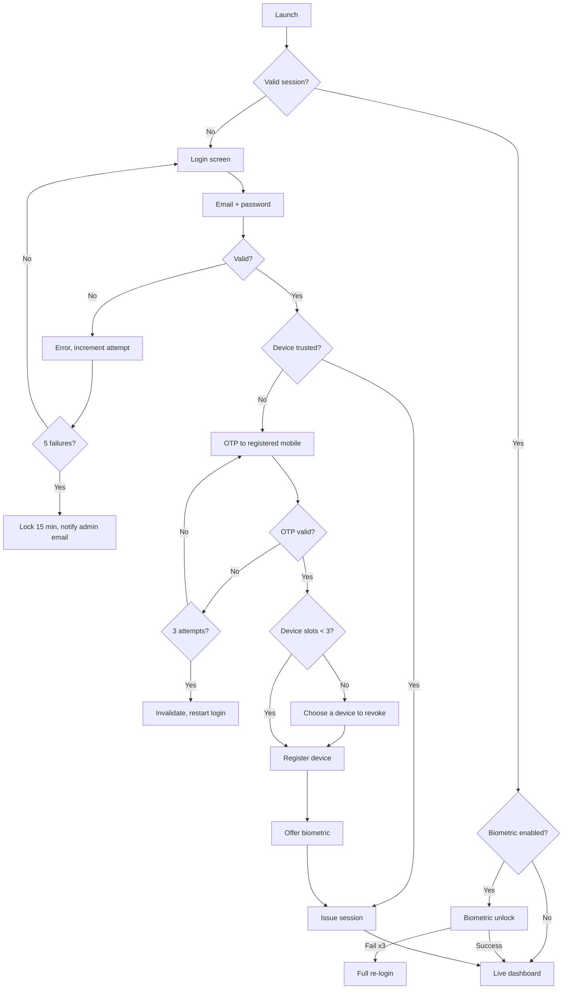
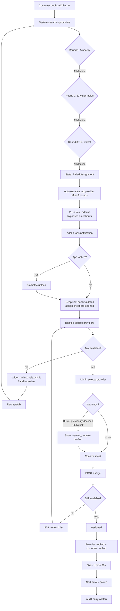
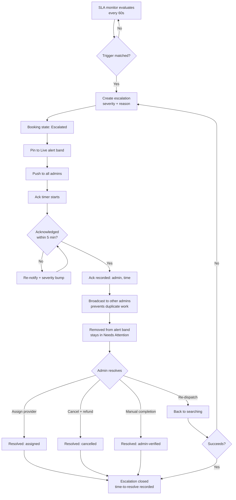
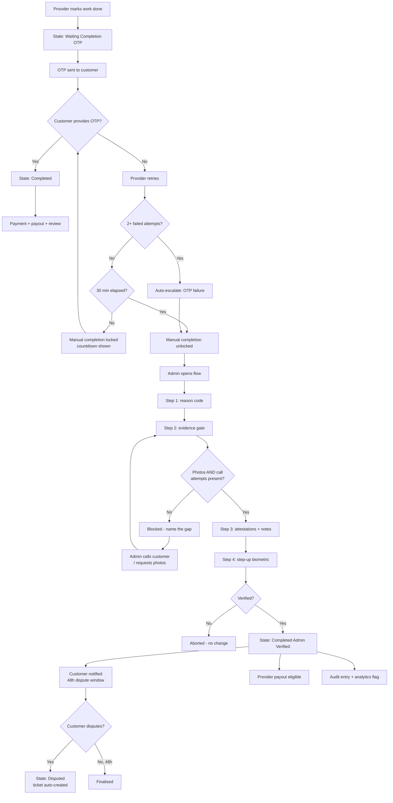
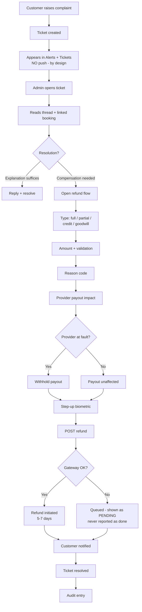
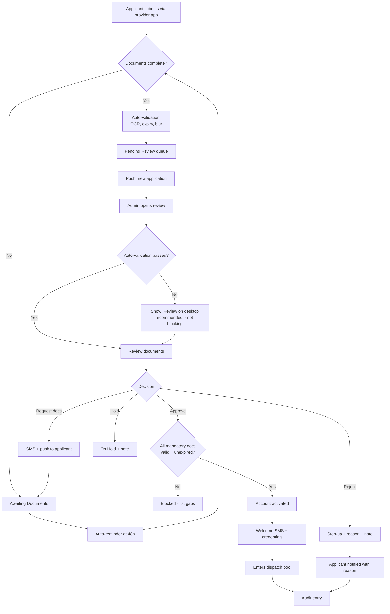
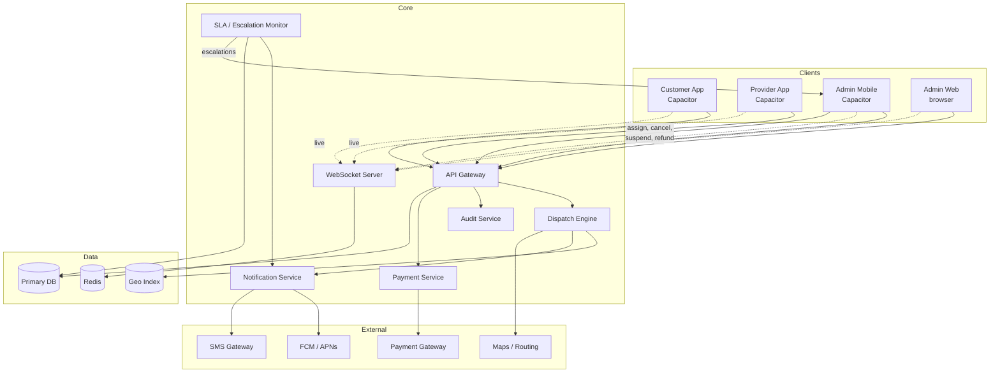

# SetuCare — Admin Mobile App

**Product Specification v1.0**

| | |
|---|---|
| **Status** | Implementation-ready |
| **Last updated** | 20 July 2026 |
| **Owner** | Product & Design |
| **Related** | [`Product.md`](./Product.md) — master brief |
| **Platform** | Capacitor (iOS + Android), responsive single-app with Admin Web Dashboard |
| **Audience** | Designers, engineers, QA, product, stakeholders |

---

## Table of Contents

1. [Overview & Scope](#1-overview--scope)
2. [Architecture](#2-architecture)
3. [Information Architecture](#3-information-architecture)
4. [Design System — Ops Mode](#4-design-system--ops-mode)
5. [Authentication & Security](#5-authentication--security)
6. [Screen Specifications](#6-screen-specifications)
7. [User Flows](#7-user-flows)
8. [Escalation & SLA Engine](#8-escalation--sla-engine)
9. [Real-Time & Offline Behaviour](#9-real-time--offline-behaviour)
10. [Permissions & Audit](#10-permissions--audit)
11. [Platform Integration](#11-platform-integration)
12. [Analytics & Instrumentation](#12-analytics--instrumentation)
13. [Edge Cases & Failure Scenarios](#13-edge-cases--failure-scenarios)
14. [MVP Scope & Roadmap](#14-mvp-scope--roadmap)
15. [Developer Handoff Checklist](#15-developer-handoff-checklist)

---

## 1. Overview & Scope

### 1.1 Purpose

The SetuCare Admin Mobile App is an **operations console for the pocket**. It exists for one reason: when something goes wrong in the dispatch flow, the person who can fix it is rarely sitting at a desk.

It is deliberately **not** a mobile port of the Admin Web Dashboard. The web dashboard is where the business is configured and analysed. The mobile app is where the business is *rescued* — a booking that found no provider, a technician running forty minutes late, a customer whose phone died before they could give the Completion OTP.

> **Design principle:** every screen in this app should answer the question *"what needs me right now, and what can I do about it in under three taps?"*

### 1.2 Primary persona

**Ravi — Operations Manager, Hyderabad**

| | |
|---|---|
| **Context** | Commuting, in the field, at home on a Sunday evening. Rarely at a desk when it matters. |
| **Device** | Mid-range Android, sometimes on 4G with patchy coverage |
| **Frequency** | Opens the app 15–40 times a day, mostly for under 60 seconds |
| **Trigger** | A push notification, or an idle-moment check of the day's numbers |
| **Success** | Escalation resolved before the customer calls to complain |
| **Frustration** | Alert noise, stale data, being forced onto a laptop for a two-tap action |

Ravi is not a casual user. He knows the domain, he knows the booking states, and he values **information density and speed** over hand-holding. The app should respect that.

### 1.3 What this app does

| Capability | Why on mobile |
|---|---|
| Monitor live operations at a glance | Time-critical; the whole point of a pocket console |
| Intervene on stuck or failed dispatches | The single highest-value admin action |
| Manually assign or reassign providers | Must happen in minutes, not when someone reaches a laptop |
| Handle escalations and SLA breaches | Push-driven, urgent by definition |
| Contact customers and providers | One-tap masked calling from context |
| Resolve undeliverable-OTP situations | Happens on the ground, in real time |
| Monitor and act on the provider roster | Suspending a bad actor cannot wait |
| Approve or reject provider applications | Unblocks supply growth |
| Handle support tickets, refunds, goodwill | Customer is on the phone *now* |
| Glance at business KPIs | Low-effort situational awareness |

### 1.4 What this app deliberately does not do

Scope discipline is a feature. The following stay on the Admin Web Dashboard:

| Excluded | Rationale |
|---|---|
| Service & category catalogue management | Infrequent, complex forms, no urgency |
| Pricing rules and surge configuration | High blast radius; deserves a large screen and care |
| Provider payouts, settlements, reconciliation | Finance workflows need tables, exports, cross-checking |
| Invoices, tax, compliance reports | Document-heavy, desktop-native |
| Deep analytics — cohorts, custom ranges, exports | Charts and filtering are poor in a phone WebView |
| Platform settings, integrations, API keys | Rare, sensitive, and not time-critical |
| Bulk operations across many records | Multi-select at scale is a desktop interaction |
| **OTP override / arbitrary state forcing** | Deliberately removed — see §1.6 |

### 1.5 Mobile / desktop boundary

Because the admin app is a **single responsive codebase** (§2.1), "desktop-only" is an explicit product rule, not a consequence of separate builds. Every route carries a `surface` flag:

| `surface` | Mobile nav | Deep link on phone |
|---|---|---|
| `all` | Visible | Renders normally |
| `desktopOnly` | Hidden | Renders **"Best on desktop"** screen with a read-only summary + "Open on desktop" action |
| `mobileOnly` | Visible | (Reserved — e.g. camera-dependent flows) |

A deep link to a `desktopOnly` route must **never** produce a blank screen, a 404, or a broken layout. It shows what it can, explains why, and offers a way forward. This is the difference between a scope decision and a bug.

#### The money boundary

Refunds are available on mobile while payouts are not. The distinction is principled:

| Allowed on mobile — *support-driven* | Desktop-only — *finance operations* |
|---|---|
| Refund a booking (full or partial) | Provider payout runs |
| Grant goodwill credit or a coupon | Settlement cycles and reconciliation |
| Waive a cancellation fee | Invoice generation |
| | Tax and compliance reports |
| | Ledger adjustments |

**Rule of thumb:** if a customer is on the phone right now and the resolution is a single bounded amount tied to one booking, it belongs on mobile. If it is a batch process, a periodic cycle, or touches the ledger, it does not.

### 1.6 The OTP override decision

SetuCare's dual-OTP system (`Product.md` § Dual OTP Verification) is a trust guarantee: the Start OTP proves the technician arrived, the Completion OTP proves the work genuinely finished before payment.

**An admin override would quietly destroy that guarantee.** If any admin can mark any job complete with one tap, the OTP becomes theatre — and the most likely abuse path is a provider persuading an overworked admin to "just close it."

So there is no override. Instead there is **Admin-Verified Manual Completion** (§6.14), a deliberately effortful flow requiring evidence, a reason code, a logged call attempt, and step-up authentication. It produces a **visibly different terminal state** — `Completed (Admin Verified)` — which is tracked separately in analytics and disclosed to the customer with a right to dispute.

> **Rationale:** the goal is not to make manual completion impossible. It is to make it *accountable, rare, and measurable*. If this state exceeds ~2% of completions, that is an operational signal worth investigating, and the metric only exists because the state is distinct.

### 1.7 Success metrics

| Metric | Target | Why it matters |
|---|---|---|
| Median time-to-acknowledge, critical alert | < 90 s | The app's core promise |
| Median time-to-resolve, failed assignment | < 5 min | Directly protects customer experience |
| % of escalations resolved on mobile (vs web) | > 70 % | Validates the app's existence |
| App-caused mis-assignments | ~0 | Speed must not cost accuracy |
| `Completed (Admin Verified)` share | < 2 % | Guards the OTP trust model |
| Notification opt-out rate | < 10 % | The canary for alert fatigue |

---

## 2. Architecture

### 2.1 The responsive single-app model

One codebase serves both the Admin Web Dashboard and the Admin Mobile App.

```
                    admin-app  (single React codebase)
                              |
              +---------------+---------------+
              |                               |
     viewport < 768px                 viewport >= 768px
     + Capacitor native shell         + browser
              |                               |
      MobileShell                      DesktopShell
      - bottom tab bar (5)             - persistent sidebar
      - stack navigation               - multi-column layouts
      - bottom sheets                  - data tables
      - density: compact               - modals, hover states
      - routes: surface != desktopOnly - all routes
```

**Why this model:** since the web dashboard is already React, a separate React Native admin app would have duplicated every screen, every type, and every piece of business logic for two audiences that share one mental model. Capacitor lets the same components serve both, and the shell abstraction keeps the mobile experience genuinely mobile rather than a squeezed dashboard.

**The risk, stated plainly:** shared codebases drift toward the dominant surface. Mitigations:

- `MobileShell` and `DesktopShell` are separate components — mobile layout is never `@media`-hacked desktop layout.
- Screens are authored as `<ScreenName.mobile.tsx>` / `<ScreenName.desktop.tsx>` where the layouts genuinely differ; shared logic lives in a `use<ScreenName>()` hook.
- CI runs visual regression on both breakpoints.
- Mobile is the **default** target in design review, not the afterthought.

### 2.2 Technology stack

| Layer | Choice | Notes |
|---|---|---|
| UI framework | **React 19** + TypeScript | Shared with all SetuCare web surfaces |
| Build | **Vite** | Fast HMR; static output suits Capacitor |
| Native shell | **Capacitor 6** | iOS + Android from the same web build |
| Routing | **React Router v7** | Route table carries the `surface` flag |
| Styling | **Tailwind CSS** + design tokens | Ops density via a token layer, not overrides |
| Components | **shadcn/ui**, extended | Ops primitives added (§4) |
| Motion | **Framer Motion** | Reduced durations vs consumer apps |
| Server state | **TanStack Query** | Caching, staleness, offline persistence |
| Client state | **Zustand** | Session, shell, connectivity, action queue |
| Real-time | **Socket.IO** | Reconnect + snapshot reconciliation |
| Maps | **MapLibre GL JS** | Open, performant in WebView |
| Forms | **React Hook Form** + **Zod** | Zod schemas shared with the API contract |
| Charts | **Recharts** | Only simple, glanceable charts on mobile |
| i18n | **`Intl` API**, `en-IN` | No translation layer needed (§4.7) |

> Note: `Product.md` originally proposed React Native. This has been superseded by Capacitor across **all three** SetuCare mobile apps, and `Product.md` has been updated accordingly.

### 2.3 Capacitor plugins

| Plugin | Use in admin app | Criticality |
|---|---|---|
| `@capacitor/push-notifications` | FCM/APNs escalation alerts | **Critical** |
| `@capacitor/local-notifications` | Quiet-hours queueing, digest | High |
| `@capacitor-community/biometric-auth` | Unlock on resume, step-up confirmation | **Critical** |
| `@capacitor/preferences` | Session token, device ID, prefs | **Critical** |
| `@capacitor/network` | Online/offline detection, banner, queue | **Critical** |
| `@capacitor/app` | Lifecycle → socket + biometric timing | **Critical** |
| `@capacitor/geolocation` | Admin location for audit + map centring | Medium |
| `@capacitor/haptics` | Confirmation and alert feedback | Medium |
| `@capacitor/device` | Device fingerprint for trusted devices | High |
| `@capacitor/browser` | External links (docs, payment console) | Low |
| `@capacitor/share` | Share booking summary to WhatsApp | Low |
| `@capacitor/camera` | Attach photo evidence to a ticket | Low |

Notably **absent**: background geolocation. The admin app never tracks the admin continuously — location is captured only at the moment of a mutating action, for the audit record. This is both a privacy decision and the reason the admin app avoids the hardest Capacitor problem (which the provider app must solve).

### 2.4 WebView performance budget

Everything runs in a WebView. These are not suggestions.

| Constraint | Requirement |
|---|---|
| Cold start to first meaningful paint | < 2.0 s on a mid-range Android |
| Route transition | < 150 ms |
| Any list > 30 rows | **Must** virtualise (`@tanstack/react-virtual`) |
| Map markers | Cluster above 50; never render > 200 DOM markers |
| Live socket updates | Batch and flush at most every 500 ms |
| Bundle, initial | < 250 KB gzipped; route-level code splitting |
| Images | WebP, lazy, explicit dimensions (no layout shift) |
| Animation | Transform/opacity only — never animate layout properties |
| Long lists | `content-visibility: auto` on off-screen rows |

**Map budget specifically:** the live map is the single heaviest screen. It is lazy-loaded, never mounted on the Live dashboard by default, unmounts fully on navigation away, and caps marker count via clustering. If frame rate drops below 30 fps on the reference device, marker density is reduced before anything else.

### 2.5 Release & OTA strategy

Capacitor enables over-the-air updates of the web layer — genuinely valuable for an ops tool where a broken dispatch screen is a business incident.

| Change type | Delivery | Review |
|---|---|---|
| UI, copy, logic, bug fix | **OTA** (Capacitor Live Updates) | Minutes |
| New plugin / native permission | App Store / Play submission | Days |
| Capacitor or native SDK upgrade | Store submission | Days |

**Rules:**
- OTA bundles are versioned and **rollback-capable within one tap** from the store build.
- The app checks for updates on resume; a non-blocking banner offers "Update ready — restart".
- A **hard minimum version** can be enforced server-side. If the client is below it, the app blocks with a forced-update screen. This exists so a dangerous bug can be killed globally.
- OTA never changes API contracts unilaterally; server and client versions are negotiated (§9.1).

### 2.6 Environments

| Environment | API | Push | Data | Access |
|---|---|---|---|---|
| Local | `localhost:4000` | Disabled | Seeded | Engineers |
| Staging | `api-staging.setucare.in` | FCM test | Anonymised copy | Internal |
| Production | `api.setucare.in` | FCM/APNs live | Live | Admins only |

Staging builds carry a **persistent coloured banner**. An ops tool where someone cancels a real booking believing they are in staging is an obvious and preventable failure.

---

## 3. Information Architecture

### 3.1 Navigation model

Five bottom tabs. Five is the maximum before targets get too small; fewer would force excessive nesting in an app whose value is speed.

```
+---------------------------------------------+
|  [ status bar ]                             |
|  +---------------------------------------+  |
|  |  Screen header (contextual)           |  |
|  +---------------------------------------+  |
|  |                                       |  |
|  |          Screen content               |  |
|  |          (stack navigation)           |  |
|  |                                       |  |
|  +---------------------------------------+  |
|  |  Live  Bookings  Providers  Alerts  More |
|  |   ^                          (3)      |  |
|  +---------------------------------------+  |
|  [ home indicator ]                         |
+---------------------------------------------+
```

| Tab | Icon | Purpose | Badge |
|---|---|---|---|
| **Live** | `activity` | Default landing. KPIs + what needs attention | Critical count (red dot) |
| **Bookings** | `clipboard-list` | Every booking, searchable | None |
| **Providers** | `users` | Roster, performance, applications | Pending applications |
| **Alerts** | `bell` | Notification history + acknowledgement | Unacknowledged critical |
| **More** | `menu` | Customers, analytics, audit, settings | Aggregate of nested |

**Badge discipline:** the Alerts badge counts **only unacknowledged critical alerts**. If the badge counted everything it would sit permanently non-zero, and a permanently non-zero badge is invisible. A badge must mean *"a human must act."*

### 3.2 Route table

`surface` values: `all` (both) · `desktopOnly` (hidden on mobile) · `mobileOnly`.

| Route | Screen | Tab | Surface | §  |
|---|---|---|---|---|
| `/splash` | Splash | — | all | 6.1 |
| `/login` | Login | — | all | 6.2 |
| `/login/otp` | OTP 2FA | — | all | 6.3 |
| `/unlock` | Biometric unlock | — | mobileOnly | 6.4 |
| `/live` | Live dashboard | Live | all | 6.5 |
| `/live/attention` | Needs-attention feed | Live | all | 6.6 |
| `/live/map` | Live operations map | Live | all | 6.7 |
| `/bookings` | Bookings list | Bookings | all | 6.8 |
| `/bookings/:id` | Booking detail | Bookings | all | 6.9 |
| `/bookings/:id/assign` | Assign / reassign | Bookings | all | 6.10 |
| `/bookings/:id/cancel` | Cancel booking | Bookings | all | 6.11 |
| `/bookings/:id/reschedule` | Reschedule | Bookings | all | 6.12 |
| `/bookings/:id/redispatch` | Re-dispatch | Bookings | all | 6.13 |
| `/bookings/:id/manual-complete` | Admin-verified completion | Bookings | all | 6.14 |
| `/providers` | Provider roster | Providers | all | 6.15 |
| `/providers/:id` | Provider profile | Providers | all | 6.16 |
| `/providers/applications` | Applications queue | Providers | all | 6.17 |
| `/providers/applications/:id` | Application review | Providers | all | 6.18 |
| `/providers/:id/suspend` | Suspend / block | Providers | all | 6.19 |
| `/alerts` | Alerts feed | Alerts | all | 6.20 |
| `/alerts/:id` | Alert detail | Alerts | all | 6.21 |
| `/more` | More menu | More | all | 6.22 |
| `/customers` | Customer lookup | More | all | 6.23 |
| `/customers/:id` | Customer profile | More | all | 6.24 |
| `/tickets` | Support tickets | More | all | 6.25 |
| `/tickets/:id` | Ticket detail | More | all | 6.26 |
| `/bookings/:id/refund` | Refund / goodwill | More | all | 6.27 |
| `/analytics` | Analytics summary | More | all | 6.28 |
| `/audit` | Audit log | More | all | 6.29 |
| `/settings/notifications` | Notification settings | More | all | 6.30 |
| `/settings/security` | Security & devices | More | all | 6.31 |
| `/profile` | Admin profile | More | all | 6.32 |
| `/support` | Help & about | More | all | 6.33 |
| `/services` | Service catalogue | — | **desktopOnly** | 6.34 |
| `/pricing` | Pricing rules | — | **desktopOnly** | 6.34 |
| `/payouts` | Payouts & settlements | — | **desktopOnly** | 6.34 |
| `/reports` | Reports & exports | — | **desktopOnly** | 6.34 |
| `/settings/platform` | Platform settings | — | **desktopOnly** | 6.34 |

**33 mobile screens**, of which 22 are primary destinations and 11 are action flows presented as sheets or modals.

### 3.3 Navigation patterns

| Pattern | Used for | Behaviour |
|---|---|---|
| **Tab switch** | Top-level sections | Preserves each tab's stack; re-tapping the active tab scrolls to top, then pops to root |
| **Push (stack)** | Drilling into a record | Slide from right, 180 ms; back gesture enabled |
| **Bottom sheet** | Filters, pickers, quick actions | Snap points; dismiss by drag or scrim tap |
| **Full-screen modal** | Multi-step destructive flows | Slide from bottom; explicit Cancel; confirm on dismiss if dirty |
| **Alert dialog** | Confirmation, step-up auth | Blocking, centred, focus-trapped |
| **Toast** | Success, queued action, undo | 4 s, bottom, above tab bar, action-capable |
| **Persistent banner** | Offline, stale data, reconnecting, forced update | Below header, non-dismissible while condition holds |

**Back-navigation guarantee:** Android hardware back and iOS edge-swipe are handled at every level. In a multi-step destructive flow with unsaved input, back prompts *"Discard changes?"* — it never silently loses work, and never traps the user.

### 3.4 Deep links

Scheme: `setucare-admin://` · Universal link: `https://admin.setucare.in/`

| Link | Destination | Source |
|---|---|---|
| `/live` | Live dashboard | Digest push |
| `/bookings/:id` | Booking detail | Escalation, SLA push |
| `/bookings/:id/assign` | Assign sheet, pre-opened | Failed-assignment push |
| `/alerts/:id` | Alert detail | Any alert push |
| `/providers/:id` | Provider profile | Provider-event push |
| `/providers/applications/:id` | Application review | New-application push |
| `/tickets/:id` | Ticket detail | Complaint notification |

**Deep-link rules:**

1. **Unauthenticated** → store the intent, authenticate, then resume the destination. Never dump the user on the dashboard after a successful login; that discards the reason they opened the app.
2. **Locked (biometric)** → unlock, then resume.
3. **Record vanished** (deleted, out of scope) → a clear "not found" screen with a route back, never a crash.
4. **State already changed** (e.g. assign link for an already-assigned booking) → open the detail screen with an informational banner: *"This booking was assigned to Suresh M. 2 minutes ago."* Silently opening an action sheet for a resolved situation causes duplicate interventions.
5. **`desktopOnly` route on a phone** → "Best on desktop" screen (§6.34).

### 3.5 Screen inventory by original brief

Mapping the seven bullets in `Product.md` § Admin Mobile App to concrete screens, to demonstrate full coverage:

| Original bullet | Screens |
|---|---|
| Live Jobs | 6.5 Live dashboard · 6.6 Needs attention · 6.7 Live map · 6.9 Booking detail |
| Assignment | 6.10 Assign/reassign · 6.13 Re-dispatch |
| Emergency Escalation | 6.6 · 6.20 Alerts feed · 6.21 Alert detail · §8 SLA engine |
| Notifications | 6.20 · 6.21 · 6.30 Notification settings |
| Provider Monitoring | 6.15 Roster · 6.16 Profile · 6.17/6.18 Applications · 6.19 Suspend |
| Customer Support | 6.23 Lookup · 6.24 Profile · 6.25/6.26 Tickets · 6.27 Refund |
| Analytics Summary | 6.5 KPI tiles · 6.28 Analytics |

---

## 4. Design System — Ops Mode

### 4.1 Philosophy

`Product.md`'s design philosophy — *premium, minimal, friendly, avoid enterprise software* — was written for the customer and provider apps, which court and reassure. The admin app serves a trained professional doing repetitive work under time pressure. It should feel like **the same product**, but behave like **a tool**.

**Ops Mode** is therefore a density variant, not a separate design language.

| Shared with consumer apps | Overridden in Ops Mode | Added for Ops Mode |
|---|---|---|
| Colour palette & semantics | Spacing base 8pt → **4pt** | Booking-state colour system |
| Type family (Inter) | Body 16px → **14px** | Severity tokens |
| Radius scale | Row height 72 → **56px** | Data-row & data-table primitives |
| Shadow / elevation | Motion 300 → **180 ms** | Metric tile, timeline, status pill |
| Icon set (Lucide) | Illustration: minimal | Live-indicator, staleness chip |
| Brand voice | Decorative imagery: none | Bulk-select affordances |

> **Rationale:** an ops user sees the same screen hundreds of times a week. Generous whitespace, which reads as premium on first encounter, reads as *wasted scrolling* on the two-hundredth. Density is respect for the expert user.

### 4.2 Colour tokens

Semantic tokens, light and dark. All pairings meet **WCAG 2.2 AA** (4.5:1 for body text, 3:1 for large text and UI boundaries).

#### Base

| Token | Light | Dark | Use |
|---|---|---|---|
| `--bg-canvas` | `#FFFFFF` | `#0B0D0E` | App background |
| `--bg-surface` | `#F7F8F9` | `#141719` | Cards, rows |
| `--bg-surface-raised` | `#FFFFFF` | `#1C2023` | Sheets, modals |
| `--bg-inset` | `#EDEFF1` | `#0F1213` | Inputs, wells |
| `--border-subtle` | `#E4E7EA` | `#252A2E` | Dividers |
| `--border-strong` | `#C9CFD5` | `#3A4147` | Input borders |
| `--text-primary` | `#0B0D0E` | `#F4F6F7` | Body |
| `--text-secondary` | `#5A646E` | `#9BA5AF` | Labels, meta |
| `--text-tertiary` | `#8B959F` | `#6B757F` | Disabled, hints |
| `--brand-primary` | `#0F6FFF` | `#4D94FF` | Primary action |
| `--brand-subtle` | `#E8F1FF` | `#12233D` | Selected states |

#### Semantic

| Token | Light | Dark | Meaning |
|---|---|---|---|
| `--success` | `#0E8A4A` | `#34C77B` | Completed, healthy |
| `--warning` | `#B76A00` | `#F2A03D` | At risk, attention |
| `--danger` | `#C4291C` | `#FF6B5E` | Failed, breached |
| `--info` | `#0F6FFF` | `#4D94FF` | In progress, neutral |
| `--neutral` | `#5A646E` | `#9BA5AF` | Inactive, expired |

Each has `-bg` (tinted surface) and `-border` companions — e.g. `--danger-bg` `#FDECEA` / `#2A1614`.

#### Severity (escalation-specific)

| Token | Light | Dark | Use |
|---|---|---|---|
| `--sev-critical` | `#C4291C` | `#FF6B5E` | Escalated, breached — pinned, pushed |
| `--sev-high` | `#D9480F` | `#FF8A4D` | SLA at risk |
| `--sev-medium` | `#B76A00` | `#F2A03D` | Needs review |
| `--sev-low` | `#5A646E` | `#9BA5AF` | Informational |

**Never encode status by colour alone.** Every status carries an icon and a text label (§4.8).

### 4.3 Booking-state colour system

All booking states from `Product.md`, plus the two introduced by this specification.

| State | Token | Pill | Icon | Admin action available |
|---|---|---|---|---|
| Pending | `neutral` | grey | `clock` | Cancel |
| Searching Provider | `info` | blue, pulsing | `radar` | Cancel · Re-dispatch |
| Provider Requested | `info` | blue | `send` | Cancel · Re-dispatch |
| Provider Accepted | `success` | green | `check` | Reassign · Cancel |
| Assigned | `success` | green | `user-check` | Reassign · Cancel · Reschedule |
| Provider En Route | `info` | blue | `navigation` | Reassign · Cancel · Call |
| Arrived | `info` | blue | `map-pin` | Call · Cancel |
| Waiting Start OTP | `warning` | amber | `key` | Call · Cancel · Reassign |
| Service Started | `success` | green | `play` | Call |
| In Progress | `success` | green | `wrench` | Call |
| Waiting Completion OTP | `warning` | amber | `key` | Call · **Manual completion** |
| **Completed** | `success` | green | `check-circle` | Refund · View |
| **Completed (Admin Verified)** | `success` | green + **striped** | `shield-check` | Refund · View audit |
| Cancelled | `neutral` | grey | `x-circle` | Refund · View |
| Failed Assignment | `danger` | red | `alert-triangle` | **Assign** · Re-dispatch · Cancel |
| Expired | `neutral` | grey | `clock-x` | Re-dispatch · Cancel |
| Rescheduled | `info` | blue | `calendar-clock` | Reassign · Cancel |
| No Response | `warning` | amber | `phone-off` | Re-dispatch · Cancel |
| **Escalated** | `sev-critical` | red, **pulsing** | `siren` | **Acknowledge** · all actions |
| **Disputed** | `danger` | red | `scale` | Refund · View · Resolve |

> **New states introduced by this document:** `Completed (Admin Verified)` and `Disputed`. Both are propagated to `Product.md`.
>
> The striped treatment on `Completed (Admin Verified)` is deliberate — it is visually a *success*, because the work was done, but it must never be mistaken for an OTP-verified completion when scanning a list.

### 4.4 Typography

Inter (variable). Ops Mode compresses the consumer ramp by roughly one step.

| Token | Size / line | Weight | Use |
|---|---|---|---|
| `--text-display` | 28 / 34 | 700 | KPI hero numbers |
| `--text-h1` | 22 / 28 | 700 | Screen titles |
| `--text-h2` | 18 / 24 | 600 | Section headers |
| `--text-h3` | 16 / 22 | 600 | Card titles |
| `--text-body` | **14 / 20** | 400 | Default body |
| `--text-body-strong` | 14 / 20 | 600 | Emphasis, names |
| `--text-label` | 13 / 18 | 500 | Field labels |
| `--text-caption` | 12 / 16 | 400 | Meta, timestamps |
| `--text-micro` | 11 / 14 | 600 | Pills, badges, tabs |
| `--text-mono` | 13 / 18 | 500 | IDs, OTPs, amounts |

- **Minimum readable size is 12px.** `--text-micro` at 11px is permitted only for uppercase pill labels with a high-contrast pairing.
- Monospace (JetBrains Mono) for booking IDs, phone numbers, OTP codes, and currency in tables — **tabular figures for anything columnar**, so numbers align and scan.
- Dynamic Type / font scaling supported up to **200%**; layouts reflow rather than clip. Test at 200% is a release gate.

### 4.5 Spacing, radius, elevation

**Spacing** — 4pt base (consumer apps use 8pt):

| Token | Value | Use |
|---|---|---|
| `--space-1` | 4px | Icon-to-label |
| `--space-2` | 8px | Within a component |
| `--space-3` | 12px | Between related elements |
| `--space-4` | 16px | Card padding, screen gutter |
| `--space-5` | 20px | Between cards |
| `--space-6` | 24px | Section separation |
| `--space-8` | 32px | Major breaks |

**Radius:** `--radius-sm` 6px (pills, inputs) · `--radius-md` 10px (cards, rows) · `--radius-lg` 14px (sheets, modals) · `--radius-full` 999px (avatars, badges).

**Elevation:** `--elev-0` flat · `--elev-1` cards (`0 1px 2px rgba(0,0,0,.06)`) · `--elev-2` sheets · `--elev-3` modals · `--elev-4` toasts. In dark mode, elevation is expressed primarily through **surface lightness** rather than shadow, which is near-invisible on dark backgrounds.

**Touch targets:** minimum **44 × 44 px**, always — including compact rows, where the visual row is 56px but the tap target spans the full width. Adjacent targets keep ≥ 8px separation.

### 4.6 Motion

| Token | Duration | Easing | Use |
|---|---|---|---|
| `--motion-instant` | 80 ms | `ease-out` | Press feedback, toggles |
| `--motion-fast` | **180 ms** | `cubic-bezier(.2,0,0,1)` | Route transitions, sheets |
| `--motion-base` | 240 ms | `cubic-bezier(.2,0,0,1)` | Modals, expansion |
| `--motion-slow` | 320 ms | `cubic-bezier(.4,0,.2,1)` | Success confirmation |
| `--motion-pulse` | 1600 ms loop | `ease-in-out` | Live indicator, escalation pill |

Consumer apps use 300–400 ms for a premium, deliberate feel. **Ops Mode runs at 180 ms** — an admin performing the same transition forty times a day experiences delight-motion as latency.

- `prefers-reduced-motion: reduce` → all transitions collapse to a 80 ms opacity fade; pulses become a static ring. This is honoured strictly, not partially.
- Only `transform` and `opacity` are animated.
- No skeleton shimmer over 400 ms — beyond that it reads as broken.

### 4.7 Formatting (`en-IN`)

UI language is English. All formatting follows Indian convention.

| Type | Format | Example |
|---|---|---|
| Currency, full | `₹` + lakh grouping | `₹2,14,500` |
| Currency, compact | Lakh / crore | `₹2.1L`, `₹1.4Cr` |
| Date | `DD/MM/YYYY` | `20/07/2026` |
| Date, short | `DD MMM` | `20 Jul` |
| Time | 12-hour + IST | `3:42 PM` |
| Relative | Under 24 h | `2m ago`, `4h ago` |
| Phone | `+91 XXXXX XXXXX` | `+91 98765 43210` |
| Booking ID | `#B-XXXX`, monospace | `#B-8823` |
| Duration | Compact | `3m 12s` |
| Percentage | One decimal max | `94.2%` |

All timestamps are stored UTC, rendered **IST** (`Asia/Kolkata`). The timezone is never user-configurable — a distributed ops team reasoning about different clocks is a source of real error.

**Multilingual data:** while the UI is English, customer and provider *content* (names, addresses, complaint text) may arrive in Devanagari or Telugu. The font stack must include `Noto Sans Devanagari` and `Noto Sans Telugu`, and no layout may assume Latin-only glyph metrics or character widths.

### 4.8 Accessibility (WCAG 2.2 AA)

| Requirement | Implementation |
|---|---|
| Contrast | 4.5:1 body, 3:1 large text and UI boundaries — verified per token pair in CI |
| Colour independence | Every status = colour **+** icon **+** text label |
| Touch targets | ≥ 44 × 44 px (WCAG 2.2 SC 2.5.8) |
| Focus visible | 2px `--brand-primary` ring, 2px offset, never suppressed |
| Screen reader | Semantic HTML; ARIA only where semantics fall short |
| Live regions | `aria-live="polite"` for feed updates; `assertive` for critical alerts only |
| Headings | One `h1` per screen; no skipped levels |
| Forms | Every input labelled; errors linked via `aria-describedby` |
| Motion | `prefers-reduced-motion` fully honoured |
| Text scaling | Functional to 200% without loss of content or function |
| Dark mode | Full parity — not a filtered inversion |
| Orientation | Portrait and landscape both supported (SC 1.3.4) |

**Announcement discipline for real-time data:** a live-updating feed that announces every change makes a screen reader unusable. Only **critical** additions are announced; routine updates change the DOM silently, and a manual "refresh summary" control reports what changed on demand.

### 4.9 Ops component library

New primitives beyond shadcn/ui:

| Component | Purpose | Key props |
|---|---|---|
| `<MetricTile>` | KPI with value, delta, sparkline | `label, value, delta, trend, onPress` |
| `<StatusPill>` | Booking / provider state | `state, size, pulse` |
| `<SeverityBadge>` | Escalation severity | `severity, count` |
| `<DataRow>` | 56px list row, up to 3 lines + action | `title, subtitle, meta, status, actions` |
| `<BookingCard>` | Booking summary with inline actions | `booking, actions, compact` |
| `<ProviderRow>` | Provider with live status + distance | `provider, showDistance, onPress` |
| `<Timeline>` | Booking state history | `events, currentState` |
| `<LiveIndicator>` | Socket connection state | `status` (`live` / `reconnecting` / `offline`) |
| `<StalenessChip>` | "Data from 3:42 PM" | `timestamp, isStale` |
| `<FilterSheet>` | Bottom-sheet multi-filter | `filters, applied, onApply` |
| `<StepUpDialog>` | Biometric / PIN confirmation | `action, onConfirm, onCancel` |
| `<ReasonCodePicker>` | Required reason selection | `codes, required, allowOther` |
| `<EmptyState>` | Illustration + explanation + action | `variant, title, body, action` |
| `<OfflineBanner>` | Connectivity + queue depth | `queuedCount, lastSync` |
| `<DesktopOnlyNotice>` | `desktopOnly` route on phone | `route, summary` |

### 4.10 Standard screen states

Every screen specifies all of these. No exceptions — unspecified states are where ops tools break.

| State | Treatment |
|---|---|
| **Loading (initial)** | Skeleton matching final layout; no spinners for content |
| **Loading (refresh)** | Existing content stays; subtle top progress bar |
| **Empty (no data)** | Illustration + one-line explanation + action where one exists |
| **Empty (filtered)** | "No results for these filters" + **Clear filters** — distinct from genuinely empty |
| **Error (recoverable)** | Inline message + **Retry**; prior content preserved where possible |
| **Error (fatal)** | Full-screen, error code, Retry + Contact support |
| **Offline (cached)** | Content + banner + `<StalenessChip>`; mutating actions disabled with reason |
| **Offline (no cache)** | Full-screen offline state + Retry |
| **Stale** | Content + "Updated 4 min ago" + manual refresh |
| **Permission denied** | Explanation + who to contact (reserved for future RBAC) |
| **Not found** | "This booking no longer exists" + route back |

---

## 5. Authentication & Security

### 5.1 Threat model

The admin app grants a single account the power to cancel bookings, suspend a provider's livelihood, issue refunds, and close jobs without OTP verification — from a phone that can be lost, stolen, or handed to a colleague.

| Threat | Mitigation |
|---|---|
| Lost / stolen device | Biometric on resume · idle expiry · remote revocation |
| SIM swap / SMS interception | Password is a required first factor — OTP alone never grants access |
| Credential sharing | Trusted-device cap (3) · every action attributed and audited |
| Shoulder surfing | Sensitive data masked by default · no OTP display in the admin app |
| Malicious or coerced insider | Full audit log · step-up on destructive actions · no OTP override |
| Session hijack | Short-lived access tokens · device-bound refresh · rotation |
| Accidental destructive action | Step-up auth · reason codes · undo window where safe |

### 5.2 Login flow



**Account creation is web-only.** There is no signup, no self-service password reset to an unverified channel, and no account recovery inside the mobile app. Admin accounts are provisioned by a Super Admin in the web dashboard. This closes the most obvious privilege-escalation path.

### 5.3 Session lifecycle

| Parameter | Value | Rationale |
|---|---|---|
| Access token TTL | 15 min | Short blast radius if intercepted |
| Refresh token TTL | 12 h absolute | Bounds a full working day |
| Idle timeout | 30 min | Unattended device protection |
| Absolute session max | 12 h | Forces daily re-auth |
| Biometric re-lock | Immediately on background | Zero-tolerance for a pocketed unlocked console |
| Trusted-device memory | 30 days | Balances friction against exposure |
| Max trusted devices | 3 | Detects and limits credential sharing |
| Refresh rotation | Every use, single-use | Reuse of a rotated token = theft → revoke all |

**On refresh-token reuse detection**, the backend revokes the entire device family and notifies the account by email. This is the standard signal that a token was exfiltrated.

### 5.4 Biometric unlock

- Uses `@capacitor-community/biometric-auth` — Face ID, Touch ID, Android BiometricPrompt.
- Triggered on **every** resume from background, regardless of duration. A three-second background trip is not a security exception, and inconsistency here trains users to expect the lock is optional.
- Fallback to device passcode after 2 biometric failures; full re-login after 3 passcode failures.
- Opt-out is permitted, but then idle timeout tightens from 30 min to **10 min**. Convenience and exposure trade against one another explicitly.
- Biometrics never leave the device and are never transmitted. The plugin returns a boolean; the session token stays in `@capacitor/preferences` behind the OS keystore.

### 5.5 Step-up confirmation

Destructive and financial actions require **fresh** biometric or passcode verification — not merely a tap-to-confirm dialog, which users learn to dismiss reflexively.

| Action | Step-up | Reason code | Undo |
|---|---|---|---|
| Assign / reassign provider | No | No | 30 s |
| Call customer or provider | No | No | — |
| Reschedule booking | No | Yes | 30 s |
| Re-dispatch | No | No | — |
| Acknowledge alert | No | No | — |
| **Cancel booking** | **Yes** | **Yes** | 10 s |
| **Manual completion** | **Yes** | **Yes** | No |
| **Refund / goodwill credit** | **Yes** | **Yes** | No |
| **Suspend / block provider** | **Yes** | **Yes** | 10 s |
| **Block customer** | **Yes** | **Yes** | 10 s |
| **Reject provider application** | **Yes** | **Yes** | No |
| Approve provider application | No | No | 30 s |

Step-up verification is valid for **60 seconds** — enough to complete a multi-field flow, not enough to leave a device armed.

**Why some actions have no undo:** a refund initiates an external payment-gateway call, and a manual completion notifies the customer and releases provider payout eligibility. Both have immediate outside-world effects and cannot be silently reversed; they are corrected by a compensating action, which is itself audited.

### 5.6 Data protection on device

| Data | Storage | Protection |
|---|---|---|
| Session tokens | `@capacitor/preferences` | OS keychain / keystore |
| Device ID | `@capacitor/preferences` | Generated once, never derived from IMEI/advertising ID |
| Cached bookings, roster | IndexedDB (TanStack persist) | Cleared on logout · **12 h TTL** |
| Customer PII | Cached only in the active session | Never persisted to disk |
| Payment details | **Never stored or displayed** | Masked references only (`•••• 4242`) |
| Audit entries | Server-side only | Never cached locally |
| Screenshots | Blocked on sensitive screens | `FLAG_SECURE` (Android); iOS privacy-blur on task switcher |

On logout — voluntary, expired, or remotely revoked — **all** cached data, query caches, and IndexedDB stores are destroyed. A device that has been revoked must retain nothing of operational value.

### 5.7 Lost-device runbook

Documented in-app under **More → Help**, because a person who has just lost their phone needs the steps to be findable from someone else's device:

1. From any browser, sign in to the Admin Web Dashboard.
2. **Settings → Security → Devices** — locate the device, tap **Revoke**.
3. Revocation takes effect within 30 seconds; the device is force-logged-out on next network contact and its cache is wiped.
4. Change the account password (invalidates every session on every device).
5. Review **Audit Log**, filtered to that device, for any actions since loss.
6. If unauthorised activity is found, contact the Super Admin to freeze the account.

### 5.8 Rate limiting & abuse protection

| Endpoint | Limit | On breach |
|---|---|---|
| Login | 5 / 15 min per account | Lock 15 min + email notification |
| OTP request | 3 / 10 min per account | Lock 30 min |
| OTP verify | 3 attempts per code | Invalidate code, restart |
| Search (bookings, customers) | 30 / min | Throttle with UI feedback |
| Mutations | 60 / min | 429 + retry-after banner |
| Refund | 10 / hour per admin | Block + flag for Super Admin review |

Refund velocity is treated as a fraud signal, not merely a load concern.

---

## 6. Screen Specifications

**How to read this section.** Every screen specifies: objective · layout · components & fields · actions · validations · states · API & real-time contract · analytics events · edge cases. ASCII sketches convey spatial arrangement only; the component and token specs are authoritative.

---

### 6.1 Splash

**Route** `/splash` · **Objective** Bootstrap the app and route the user correctly before they perceive a wait.

Not a branding moment — it is a decision point. Target: **under 800 ms** to a routing decision.

**Behaviour**

1. Render logo on `--bg-canvas` (no animation beyond a 180 ms fade-in).
2. In parallel: read session from Preferences · check network · check minimum-version requirement · resolve any pending deep link.
3. Route:

| Condition | Destination |
|---|---|
| Below minimum version | Forced-update screen (blocking, no dismiss) |
| No session | `/login` |
| Session valid + biometric on | `/unlock` |
| Session valid + biometric off | `/live` or the pending deep-link target |
| Session expired, refresh valid | Silent refresh → destination |
| Offline + cached session | `/live` in offline mode with banner |

**States** — Loading: logo only, no spinner before 800 ms (a spinner that flashes for 200 ms reads as jank). Slow (> 3 s): add "Connecting…". Error: "Couldn't start" + Retry + Sign out.

**Edge cases** — Corrupt session data → clear and route to `/login`, never crash. Clock skew > 5 min → tokens may appear expired; trust the server, force refresh. Deep link during cold start → preserved through the entire auth chain.

**Analytics** — `app_launched { cold, version, hasSession }` · `app_launch_completed { durationMs, destination }`

---

### 6.2 Login

**Route** `/login` · **Objective** Authenticate a provisioned admin with the first factor.

```
+-----------------------------------+
|                                   |
|          [ SetuCare ]             |
|          Admin Console            |
|                                   |
|  Email                            |
|  +-----------------------------+  |
|  | ravi@setucare.in            |  |
|  +-----------------------------+  |
|                                   |
|  Password                         |
|  +-----------------------------+  |
|  | ••••••••••••          [eye] |  |
|  +-----------------------------+  |
|                                   |
|  [        Continue           ]    |
|                                   |
|  Forgot password?                 |
|                                   |
|  Admin accounts are created by    |
|  your Super Admin.                |
+-----------------------------------+
```

**Fields**

| Field | Type | Validation | Error |
|---|---|---|---|
| Email | `email`, autocomplete `username` | Required · valid format · trimmed · lowercased | "Enter a valid email address" |
| Password | `password`, autocomplete `current-password` | Required · min 8 | "Enter your password" |

**Actions** — **Continue** (primary, full-width, disabled until both valid, spinner while pending) · **Forgot password?** → opens the web reset flow in `@capacitor/browser`; reset never completes inside the app · **Show/hide password** (toggle, `aria-pressed`).

**Validations & errors**

| Case | Message | Note |
|---|---|---|
| Invalid credentials | "Email or password is incorrect" | Deliberately does not reveal which — no account enumeration |
| Account locked | "Too many attempts. Try again in 14:32" | Live countdown |
| Account disabled | "This account has been disabled. Contact your Super Admin." | Terminal |
| Network failure | "Can't reach SetuCare. Check your connection." | Retry preserves input |
| Server error | "Something went wrong (E-500). Try again." | Code aids support |

**States** — Idle · Validating (inline, on blur) · Submitting (button spinner, fields locked) · Error (inline, focus moves to the message, input preserved) · Locked (form disabled + countdown) · Offline (form disabled + banner — login genuinely requires connectivity).

**API**

```http
POST /api/v1/admin/auth/login
{ "email": "ravi@setucare.in", "password": "...", "deviceId": "dev_a1b2c3", "deviceName": "iPhone 14" }

200 { "status": "otp_required", "otpToken": "...", "maskedMobile": "+91 •••••43210", "expiresIn": 300 }
200 { "status": "authenticated", "accessToken": "...", "refreshToken": "...", "admin": {...} }
401 { "error": "INVALID_CREDENTIALS" }
423 { "error": "ACCOUNT_LOCKED", "retryAfter": 872 }
403 { "error": "ACCOUNT_DISABLED" }
```

**Edge cases** — Password manager autofill must work (correct `autocomplete` attributes). Keyboard must not obscure the submit button (scroll into view on focus). Backgrounding mid-login discards the in-flight attempt. Paste into password is permitted — blocking it weakens security by discouraging password managers.

**Analytics** — `login_attempted` · `login_failed { reason }` · `login_locked` · `password_reset_opened`

---

### 6.3 OTP Two-Factor

**Route** `/login/otp` · **Objective** Verify the second factor and register the device.

```
+-----------------------------------+
|  <  Verify it's you               |
|                                   |
|  We sent a 6-digit code to        |
|  +91 •••••43210                   |
|                                   |
|   +--+ +--+ +--+ +--+ +--+ +--+   |
|   |4 | |8 | |2 | |  | |  | |  |   |
|   +--+ +--+ +--+ +--+ +--+ +--+   |
|                                   |
|  Code expires in 4:37             |
|                                   |
|  [        Verify             ]    |
|                                   |
|  Didn't get it? Resend in 0:24    |
|                                   |
|  [x] Trust this device (30 days)  |
+-----------------------------------+
```

**Components** — Six-cell OTP input (`inputmode="numeric"`, `autocomplete="one-time-code"`, auto-advance, backspace retreats, paste distributes across cells, auto-submit on the sixth digit) · expiry countdown · resend with 30 s cooldown · trust-device checkbox (default **on**).

**Validations**

| Case | Message |
|---|---|
| Incomplete | Verify disabled |
| Wrong code | "That code isn't right. 2 attempts left." — cells shake 180 ms, clear, refocus first |
| 3rd failure | "Too many attempts." → back to `/login`, OTP token invalidated |
| Expired | "This code expired." → Resend becomes primary |
| Resend limit | "Too many requests. Try again in 28:14" |

**Device-slot handling** — if 3 devices are already trusted, a full-screen picker appears listing each device (name, last used, location) with a Revoke action. Proceeding requires revoking one. Revocation is immediate and audited.

**States** — Entering · Verifying · Error · Expired · Locked · Device-limit.

**API**

```http
POST /api/v1/admin/auth/verify-otp
{ "otpToken": "...", "code": "482913", "trustDevice": true, "deviceId": "dev_a1b2c3" }

200  { "accessToken", "refreshToken", "admin", "deviceTrustedUntil" }
400  { "error": "INVALID_OTP", "attemptsRemaining": 2 }
410  { "error": "OTP_EXPIRED" }
409  { "error": "DEVICE_LIMIT_REACHED", "devices": [...] }
```

**Edge cases** — Android SMS auto-fill supported via `autocomplete="one-time-code"`. Backgrounding to read the SMS must not reset the timer or clear entry. Two OTPs requested → only the latest is valid, and the copy says so. **The admin OTP is entirely separate from booking Start/Completion OTPs** — no shared code path, no shared storage, no possibility of cross-contamination.

**Analytics** — `otp_screen_viewed` · `otp_submitted` · `otp_failed { attemptsRemaining }` · `otp_resent` · `device_trusted` · `device_revoked_at_limit`

---

### 6.4 Biometric Unlock

**Route** `/unlock` · **Surface** mobileOnly · **Objective** Re-verify identity on resume without a full login.

Presented as a **blocking overlay** above the previous screen, blurred — so context is preserved and the admin knows where they will land, but nothing sensitive is readable.

**Behaviour** — Biometric prompt fires automatically on mount · success dismisses in 180 ms · 2 failures → "Use passcode" · 3 passcode failures → session cleared, full re-login. Manual retry button if the prompt is dismissed. "Sign out" always available.

**Edge cases** — Biometrics removed/changed at OS level → fall back to passcode, then re-login (a changed enrolment may mean a new person's finger). Hardware unavailable → passcode. Prompt cancelled → app stays locked; content never leaks. Push notification arriving while locked → tapping it unlocks first, then honours the deep link.

**Analytics** — `biometric_prompt_shown` · `biometric_success { durationMs }` · `biometric_failed` · `biometric_fallback_passcode` · `session_expired_at_unlock`

---

### 6.5 Live Dashboard ★

**Route** `/live` · **Tab** Live (default) · **Objective** Answer *"is everything okay, and if not, what needs me?"* within three seconds of opening the app.

This is the most important screen in the product. It is opened dozens of times a day, often for seconds.

```
+-----------------------------------+
| Live            [LIVE] [map] [⟳]  |
+===================================+
| !! 2 NEED ATTENTION               |  <- alert band
|    Escalated #B-8823 · 2m    [>]  |     never scrolls away
+===================================+
| Today  |  Live now                |  <- segmented
+-----------------------------------+
| +-------------+ +-------------+   |
| | Bookings    | | Revenue     |   |
| |   142       | |  ₹2.1L      |   |
| |   ^ 12%     | |  ^ 8%       |   |
| |  ~~~~~~~    | |  ~~~~~~~    |   |
| +-------------+ +-------------+   |
| +-------------+ +-------------+   |
| | Completion  | | Avg assign  |   |
| |   94.2%     | |  3m 12s     |   |
| |   v 2%      | |  ^ 40s      |   |
| +-------------+ +-------------+   |
+-----------------------------------+
| NEEDS ATTENTION            See all|
| ! SLA risk  #B-8817        6m     |
|   Plumbing · Suresh late 11m      |
|   [Call]  [Reassign]              |
| ! No provider #B-8830      5m     |
|   AC Repair · Kompally            |
|   [Assign]  [Re-dispatch]         |
+-----------------------------------+
| ACTIVITY                          |
| ● #B-8801 completed        1m     |
| ● #B-8799 started          3m     |
+-----------------------------------+
| Live  Bookings  Providers  Alerts  More |
+-----------------------------------+
```

#### Structure & rationale

The KPI-dashboard framing was chosen over a map-first or feed-first layout, but urgency must not be buried beneath metrics. Hence the vertical priority:

1. **Alert band** — sticky, above everything, only rendered when unacknowledged critical items exist. Occupies zero space when operations are healthy. Tapping opens `/live/attention`.
2. **KPI tiles** — the "is everything okay" answer, at a glance.
3. **Needs attention** — up to 3 items with inline actions; drill-through for the rest.
4. **Activity** — a calm, low-priority live ticker confirming the system is alive.

> **Why the alert band is not dismissible:** an admin who can swipe away an escalation will, during a busy moment, and then forget. It disappears only when the underlying alert is acknowledged — the act that creates accountability.

#### Components & data

| Component | Data | Interaction |
|---|---|---|
| `<LiveIndicator>` | Socket state | Tap → connection detail |
| Map button | — | → `/live/map` (lazy-loaded) |
| Refresh | — | Manual refetch; also pull-to-refresh |
| `<SeverityBadge>` band | Unacknowledged critical count | Tap → `/live/attention` |
| Segmented control | `Today` / `Live now` | Today = 00:00 IST onward; Live now = currently active |
| `<MetricTile>` ×4 | Bookings · Revenue · Completion · Avg assign time | Tap → `/analytics` anchored to that metric |
| `<BookingCard>` ×3 | Highest-priority attention items | Inline actions; tap → detail |
| Activity ticker | Last 10 state transitions | Tap → detail |

**KPI definitions** (documented because ambiguous metrics cause arguments):

| Metric | Definition | Delta baseline |
|---|---|---|
| Bookings | Bookings created since 00:00 IST | Same period yesterday |
| Revenue | Sum of completed booking values, incl. `Admin Verified` | Same period yesterday |
| Completion rate | Completed ÷ (Completed + Cancelled + Failed) | Same period yesterday |
| Avg assign time | Mean `Searching Provider` → `Assigned` | Same period yesterday |

Deltas are green when favourable — note that a *rising* assign time is unfavourable, so trend arrows are semantic, not merely directional.

**Actions** — Pull to refresh · tap tile → analytics · tap card → detail · inline Assign / Reassign / Call / Re-dispatch (§6.10, §6.13) · long-press card → quick-action sheet.

**States**

| State | Treatment |
|---|---|
| Loading | Skeleton tiles + 3 skeleton rows |
| Healthy | No alert band; "Needs attention" shows "All clear ✓" |
| Empty (no bookings today) | Tiles show `—`; empty-state illustration |
| Offline | Banner + `<StalenessChip>`; inline actions disabled with "Reconnect to act" |
| Reconnecting | Amber `<LiveIndicator>`; content stays live |
| Stale (> 5 min) | "Updated 6 min ago" + Refresh |
| Error | Tiles show `—` + inline retry; attention list still renders from cache |
| Degraded (KPIs fail, live OK) | Tiles error independently; attention section unaffected |

**API & real-time**

```http
GET /api/v1/admin/dashboard/summary?period=today
GET /api/v1/admin/dashboard/attention?limit=3
GET /api/v1/admin/activity?limit=10
```

WebSocket `admin:live` subscription:

| Event | Effect |
|---|---|
| `booking.state_changed` | Update card, prepend to activity |
| `booking.escalated` | Insert into band, haptic, `aria-live` assertive |
| `booking.assignment_failed` | Insert into attention list |
| `sla.breached` / `sla.at_risk` | Insert / update |
| `alert.acknowledged` | Remove from band (possibly by another admin) |
| `kpi.updated` | Refresh tiles (throttled 30 s) |

Updates are batched and flushed at most every 500 ms.

**Edge cases** — Attention list changes while an action sheet is open → the sheet keeps its target; the underlying list reorders. Another admin acknowledges first → band updates live with a brief "Acknowledged by Priya S." toast, preventing duplicate work. Socket drops → auto-reconnect with exponential backoff (1s, 2s, 4s, 8s, max 30s); on reconnect, refetch a full snapshot and reconcile rather than replaying missed events. More than 9 critical items → band shows "9+".

**Analytics** — `dashboard_viewed { criticalCount, isOffline }` · `dashboard_refreshed { manual }` · `kpi_tile_tapped { metric }` · `attention_item_actioned { action, bookingId, secondsSinceSurfaced }` · `alert_band_tapped`

---

### 6.6 Needs-Attention Feed

**Route** `/live/attention` · **Objective** The complete, prioritised queue of everything requiring admin intervention.

Where the dashboard shows the top 3, this shows all of them, ordered by a deterministic priority — **never** simply reverse-chronologically, because the newest problem is rarely the worst one.

**Priority ordering**

1. Escalated, unacknowledged (oldest first — longest-suffering customer first)
2. SLA breached
3. Failed assignment
4. SLA at risk
5. No response / expired
6. Escalated, acknowledged but unresolved

Within a tier, oldest first.

**Layout** — Filter chips (`All` · `Escalated` · `Unassigned` · `SLA` · `Delayed`) over a virtualised list of `<BookingCard>`s, each showing state pill, booking ID, service, area, elapsed time, provider (if any), the *reason* it needs attention, and up to two inline actions.

**Actions** — Inline Assign · Reassign · Call · Re-dispatch · Acknowledge · Cancel. Tap → booking detail. Swipe right → Acknowledge; swipe left → quick actions. Long-press → full action sheet.

**States** — Loading skeleton · **All clear** (a genuinely positive empty state: "Nothing needs attention. 42 jobs running smoothly.") · Filtered-empty (distinct, with Clear filters) · Offline (actions disabled) · Error with retry.

**API** — `GET /api/v1/admin/dashboard/attention?filter=&cursor=` (cursor-paginated, 20/page). Same `admin:live` subscription as the dashboard.

**Edge cases** — An item resolving while on screen animates out over 240 ms with a "Resolved" flash rather than vanishing (an item disappearing under the thumb causes mis-taps). Optimistic acknowledgement reverts with a toast if the server rejects. If the list empties entirely while being viewed, the all-clear state animates in.

**Analytics** — `attention_feed_viewed { itemCount }` · `attention_filtered { filter }` · `attention_action { action, priority, ageSeconds }` · `attention_swipe_action`

---

### 6.7 Live Operations Map

**Route** `/live/map` · **Objective** Spatial awareness — where jobs and providers are, and where the gaps are.

Deliberately **not** the default view: it is the heaviest screen in the app, and most admin decisions are list-based rather than spatial. It is lazy-loaded and fully unmounted on navigation away.

```
+-----------------------------------+
|  <  Live Map      [layers] [⊙]    |
+-----------------------------------+
|                                   |
|      ○ ○      ▲!                  |
|   ○      ▲         ○              |
|         ○     ▲                   |
|    (12)              ○            |  <- cluster
|                                   |
+-----------------------------------+
| ==== drag handle ====             |
| 42 active · 18 providers online   |
| ! #B-8823 Escalated · Kompally    |
| ! #B-8830 No provider · Miyapur   |
+-----------------------------------+
```

**Markers** — `○` provider available (green) · `●` provider on job (blue) · `▲` active job (state colour) · `▲!` escalated (red, pulsing) · `(n)` cluster. Provider positions update via socket, throttled to **10 s** — battery and bandwidth matter more than sub-second pin accuracy.

**Layers** (toggle sheet) — Active jobs · Providers online · Escalations only · Heatmap of demand · Service-area boundaries.

**Performance rules** — cluster above 50 markers; hard cap 200 DOM markers; only render the current viewport plus a 20% buffer; unmount the GL context on blur; disable 3D/tilt; raster tiles on low-end devices.

**Edge cases** — Location permission denied → map still works, centred on the primary service city, with a non-blocking prompt. GPS unavailable → same. Zero providers online → an explicit warning banner, since this is a genuine business emergency. Poor connectivity → tiles degrade to cached; markers show a staleness chip.

**Analytics** — `map_viewed` · `map_layer_toggled { layer }` · `map_marker_tapped { type }` · `map_performance { markerCount, fps }`

---

### 6.8 Bookings List

**Route** `/bookings` · **Tab** Bookings · **Objective** Find any booking fast, and see the operational picture per lifecycle segment.

```
+-----------------------------------+
| Bookings                    [⚲]   |
| +-------------------------------+ |
| | Search ID, phone, name        | |
| +-------------------------------+ |
| Active | Scheduled | Done | Canc  |
|                        [Filter 2] |
+-----------------------------------+
| #B-8823          [Escalated]      |
| AC Repair · Ravi Kumar            |
| Kompally · 3:30 PM · ₹1,499       |
| Provider: unassigned · 12m        |
+-----------------------------------+
| #B-8817          [En Route]       |
| Plumbing · Anita Sharma           |
| Gachibowli · 4:00 PM · ₹899       |
| Provider: Suresh M. · ETA 8m      |
+-----------------------------------+
```

**Segments** — **Active** (all in-flight states, default) · **Scheduled** (future-dated, not yet dispatched) · **Completed** (incl. Admin Verified) · **Cancelled** (incl. Failed Assignment, Expired). Each shows a count; Active pulses if it contains escalations.

**Search** — debounced 300 ms, minimum 3 characters, matches booking ID (with or without `#B-`), customer phone (with or without `+91`), customer name (fuzzy), provider name, address/area. Recent searches persist locally (10 max, clearable). Server-side; results ranked by relevance then recency.

**Filter sheet** — Service category (multi) · Booking state (multi) · Date range (Today / Yesterday / Last 7 / Custom) · Area/zone (multi) · Provider (searchable) · Amount range · Payment status. Applied count shows on the button; **Clear all** always present. Filters persist within a session, reset on app restart.

**Row content** — booking ID (mono) · state pill · service · customer name · area · scheduled time · amount · provider or "unassigned" · elapsed/ETA. Escalated rows carry a left red border.

**Actions** — Tap → detail · long-press → quick actions · pull to refresh · infinite scroll (20/page).

**States** — Loading (8 skeleton rows) · Empty per segment (segment-specific copy) · Filtered-empty (+ Clear filters) · Search-empty ("No bookings match 'xyz'" + tips) · Offline (cached + banner, search limited to cache with a notice) · Error + retry.

**API**

```http
GET /api/v1/admin/bookings?segment=active&cursor=&limit=20
    &service[]=&state[]=&from=&to=&area[]=&providerId=&minAmount=&maxAmount=
GET /api/v1/admin/bookings/search?q=&limit=20
```

Socket `admin:bookings` — `booking.created` (prepend if matching), `booking.state_changed` (update in place), `booking.assigned`.

**Edge cases** — A booking changing segment while viewed (e.g. Active → Completed) animates out with a toast: *"#B-8801 completed — moved to Completed."* Silent removal is disorienting. Search while offline searches only cache and says so. Very large result sets cap at 500 with a "refine your search" prompt.

**Analytics** — `bookings_viewed { segment }` · `bookings_searched { queryType, resultCount }` · `bookings_filtered { filters, resultCount }` · `booking_opened { from, state }`

---

### 6.9 Booking Detail ★

**Route** `/bookings/:id` · **Objective** Everything about one booking, and every action available on it, in one scrollable screen.

The operational hub. An admin arriving from a push notification must understand the situation without scrolling and act without hunting.

```
+-----------------------------------+
| <  #B-8823              [⋮]       |
+-----------------------------------+
| [!] ESCALATED · 12m unresolved    |
| No provider found after 3 rounds  |
| [   Acknowledge   ] [ Assign ]    |
+-----------------------------------+
| AC Repair — Deep Clean            |
| ₹1,499 · Prepaid (UPI)            |
| Scheduled 20/07/2026, 3:30 PM     |
+-----------------------------------+
| CUSTOMER                          |
| Ravi Kumar        [call] [msg]    |
| +91 98765 43210                   |
| 401, Aparna Cyber, Kompally,      |
| Hyderabad 500014          [map]   |
| 14 bookings · joined Mar 2025     |
+-----------------------------------+
| PROVIDER                          |
| Not assigned                      |
| 3 search rounds · 8 declined      |
| [    Assign provider     ]        |
+-----------------------------------+
| TIMELINE                          |
| ● Created           3:12 PM       |
| ● Searching         3:12 PM       |
| ● Round 1 — 5 sent  3:13 PM       |
| ● Round 2 — 8 sent  3:16 PM       |
| ● Round 3 — 12 sent 3:21 PM       |
| ! Failed assignment 3:26 PM       |
| ! Escalated         3:26 PM       |
+-----------------------------------+
| PAYMENT                           |
| ₹1,499 prepaid · UPI ····4242     |
| Paid 3:12 PM · TXN8891023         |
+-----------------------------------+
```

**Sections** — Status banner (only when escalated / at risk / failed) · Service summary · Customer · Provider (or search diagnostics) · Timeline · Payment · Notes · Ratings (post-completion) · Audit trail (admin actions on this booking).

**Contextual actions** — the action bar renders only what the current state permits (§4.3). Primary action is state-dependent: `Failed Assignment` → **Assign provider**; `Escalated` → **Acknowledge**; `Waiting Completion OTP` (> 30 min) → **Manual completion**; `Completed` → **Refund**. The overflow `⋮` holds secondary actions: Reschedule · Cancel · Re-dispatch · Copy ID · Share summary · View full audit.

**Calling** — `tel:` via the native dialer, routed through a masking service so the admin's personal number is never exposed. Every call attempt is logged to the booking timeline whether or not it connects — critical evidence for the manual-completion flow (§6.14).

**Timeline** — full state history with timestamps, actor (system / admin name / provider / customer), and dispatch-round detail (how many providers contacted, how many declined, why). This is the primary diagnostic tool for "why did this fail?" and is the reason dispatch rounds are exposed rather than summarised.

**States** — Loading (skeleton preserving section structure) · Loaded · Not found ("This booking no longer exists" + back) · Offline (cached + banner; mutating actions disabled with "Reconnect to act") · Stale · Error · Updating (optimistic with a subtle progress bar).

**API**

```http
GET /api/v1/admin/bookings/:id            -> full detail incl. timeline, dispatch rounds, payment, audit
GET /api/v1/admin/bookings/:id/timeline
```

Socket: subscribes to `booking:{id}` for `state_changed`, `provider_assigned`, `provider_location`, `otp_attempted`, `escalated`, `note_added`.

**Edge cases** — State changing while viewed → banner "This booking was just assigned to Suresh M." and the action bar re-renders; an admin must never act on a stale action set. Two admins acting simultaneously → server enforces optimistic concurrency via `version`; the loser gets "This booking was updated by Priya S. Reloading." Booking cancelled by the customer mid-view → banner + actions collapse to view-only. Very long timelines collapse to the last 10 with "Show all".

**Analytics** — `booking_detail_viewed { state, source, isEscalated }` · `booking_action_initiated { action, state }` · `booking_call_placed { party }` · `booking_timeline_expanded` · `booking_concurrent_edit_conflict`

---

### 6.10 Assign / Reassign Provider ★

**Route** `/bookings/:id/assign` · **Presentation** Full-screen modal · **Objective** Put the right technician on a stuck job in under 30 seconds.

The highest-value action in the app. Every design choice optimises for a correct decision made quickly.

```
+-----------------------------------+
| X  Assign provider       #B-8823  |
+-----------------------------------+
| AC Repair · Kompally · 3:30 PM    |
+-----------------------------------+
| [Recommended] Nearby | All        |
+-----------------------------------+
| Suresh Mehta          ★4.8  ●     |
| 2.1 km · ~8 min · AC certified    |
| 3 jobs today · 96% completion     |
| Available now         [ Assign ]  |
+-----------------------------------+
| Kiran Rao             ★4.6  ●     |
| 3.4 km · ~12 min · AC certified   |
| 5 jobs today · 91% completion     |
| Available now         [ Assign ]  |
+-----------------------------------+
| Ajay Verma            ★4.9  ◐     |
| 1.8 km · ~6 min · AC certified    |
| On job — free ~4:10 PM            |
| Busy                  [ Assign ]  |
+-----------------------------------+
| ⚠ 8 providers declined this job   |
+-----------------------------------+
```

**Ranking** — the Recommended tab is scored, and the weighting is documented because an unexplained ranking will not be trusted:

| Factor | Weight | Note |
|---|---|---|
| Distance / ETA | 35% | Primary customer-experience driver |
| Skill match | 25% | Certification for the service category |
| Availability | 20% | Free now ranks above soon-free |
| Rating | 10% | Rolling 90-day |
| Current load | 10% | Fewer jobs today ranks higher |

Providers who **already declined** this booking are shown at the bottom, greyed, with "Declined 3:16 PM" — assignable, but the admin sees the friction they are overriding. Suspended or blocked providers do not appear at all.

**Per-provider data** — name · photo · rating · live status (available / on job / offline) · distance and ETA · certifications with match indicator · jobs today · 90-day completion rate · earliest availability · decline history for this booking.

**Filters** — skill match only (default on) · maximum distance · available now only · minimum rating.

**Flow**

1. Tap **Assign** on a provider.
2. Confirmation sheet: provider, customer, ETA impact, and — if the booking is scheduled — whether the provider can realistically arrive on time.
3. Warnings appear for: assigning a busy provider · assigning a previous decliner · ETA exceeding the scheduled slot · provider offline > 15 min.
4. Confirm → optimistic update, modal dismisses, toast with **Undo (30 s)**.
5. Notifications fire to provider and customer.

**Validations**

| Case | Behaviour |
|---|---|
| Provider went offline mid-flow | Blocked — "Suresh went offline. Choose another." List refreshes |
| Provider taken by another job | Blocked — "No longer available" |
| Booking already assigned | Modal closes with "Already assigned to Kiran R. by Priya S." |
| Booking cancelled meanwhile | Modal closes, explanatory toast |
| Offline | Entire flow blocked — assignment on stale data is genuinely dangerous |

> **Why assignment is never queued offline:** every other queued action is either idempotent or harmless. Assigning a provider who was claimed twenty minutes ago produces a double-booked technician and a failed customer visit. Blocked is correct.

**States** — Loading (skeleton rows) · Loaded · No providers available (explicit empty state + **Widen search radius** and **Re-dispatch** options) · Searching (live-refreshing) · Assigning (row spinner, list locked) · Error + retry · Offline (blocked with explanation).

**API**

```http
GET  /api/v1/admin/bookings/:id/eligible-providers?sort=recommended&maxDistance=&availableOnly=
POST /api/v1/admin/bookings/:id/assign
     { "providerId": "prv_882", "overrideReason": "manual_dispatch", "version": 7 }

200  { booking }
409  { "error": "PROVIDER_UNAVAILABLE" | "ALREADY_ASSIGNED", "booking": {...} }
```

Socket: `provider.status_changed` live-updates rows; a provider going offline greys their row **in place** rather than removing it, so the list does not reflow under a moving thumb.

**Edge cases** — Zero eligible providers → the empty state offers widening radius, relaxing skill match (with a warning), or re-dispatching. Undo within 30 s reverts and notifies both parties of the reversal. Provider's device is offline → assignment still succeeds; they receive it on reconnect, and the UI says so.

**Analytics** — `assign_screen_viewed { candidateCount, isReassign }` · `assign_filtered` · `assign_confirmed { rank, distanceKm, wasDecliner, wasBusy, secondsToDecide }` · `assign_failed { reason }` · `assign_undone` · `assign_no_candidates`

---

### 6.11 Cancel Booking

**Route** `/bookings/:id/cancel` · **Presentation** Full-screen modal · **Step-up** Required

**Flow** — Impact summary (customer notified · provider released · refund consequence) → **required** reason code → optional note → refund decision → step-up biometric → confirm.

**Reason codes** — Customer requested · Customer unreachable · No provider available · Provider unavailable · Duplicate booking · Out of service area · Pricing dispute · Safety concern · Test/internal · Other (note becomes mandatory).

**Refund handling** — for prepaid bookings the modal shows the applicable policy and the computed amount, with an override available (override requires its own justification and is separately audited). Cancellation fees are waivable in the same flow.

**Validations** — reason required · "Other" requires ≥ 10 characters · refund override requires justification · terminal-state bookings cannot be cancelled (button absent, and a race is caught server-side) · in-progress bookings show an extra warning that a technician is on site.

**API** — `POST /api/v1/admin/bookings/:id/cancel` with `{ reasonCode, note, refund: { type, amount, waiveFee }, stepUpToken, version }`.

**Edge cases** — Booking completed while the modal is open → blocked with explanation. Provider already en route → warning naming them, and they are notified immediately on confirm. Payment gateway failure during refund → booking still cancels, refund enters a retry queue, and the admin is told the refund is pending rather than done.

**Analytics** — `cancel_initiated { state }` · `cancel_reason_selected { code }` · `cancel_confirmed { refundType, refundAmount, feeWaived }` · `cancel_abandoned { step }`

---

### 6.12 Reschedule Booking

**Route** `/bookings/:id/reschedule` · **Presentation** Bottom sheet · **Step-up** Not required (reversible)

Date picker (today + 14 days) → available slot grid (capacity-aware, showing provider availability per slot) → reason code → optional customer note → confirm.

**Behaviour** — If a provider is already assigned, the sheet asks whether to **keep** them (only offered when they are available in the new slot) or **release and re-dispatch**. Keeping an unavailable provider is not offered at all.

**Validations** — new slot must be in the future · slot must have capacity (full slots are disabled with "Fully booked") · reason required · rescheduling within 2 hours of the original slot warns about customer inconvenience.

**API** — `GET /api/v1/admin/bookings/:id/available-slots?from=&to=` · `POST /api/v1/admin/bookings/:id/reschedule`.

**Edge cases** — Slot filling while the sheet is open → 409, grid refreshes, selection cleared with an explanation. Customer having already rescheduled twice → warning (policy limit). Rescheduling past a prepaid booking's validity → blocked with an explanation.

**Analytics** — `reschedule_initiated` · `reschedule_confirmed { daysOut, providerKept, reasonCode }` · `reschedule_slot_conflict`

---

### 6.13 Re-dispatch

**Route** `/bookings/:id/redispatch` · **Presentation** Bottom sheet · **Step-up** Not required

Restarts the automated provider search for a booking that failed, expired, or received no response — the "try again, but smarter" action.

**Options** — search radius (default / +50% / +100% / city-wide) · relax skill match to related categories (warned) · include previous decliners · priority boost (surfaces the job at the top of provider queues) · incentive bump (adds a surge amount to the provider payout, capped, and shown as a cost).

**Behaviour** — Confirming sets the booking to `Searching Provider`, starts a fresh dispatch cycle, and returns to detail with a live search indicator. The timeline records the re-dispatch and its parameters, so a later reader can see exactly what was tried.

**Validations** — only available from `Failed Assignment`, `Expired`, `No Response`, `Pending`, `Cancelled` (within 1 hour) · incentive bump capped at 50% of booking value · city-wide radius warns about ETA impact.

**API** — `POST /api/v1/admin/bookings/:id/redispatch` with `{ radiusMultiplier, relaxSkillMatch, includeDecliners, priorityBoost, incentiveAmount }`.

**Edge cases** — Repeated re-dispatch failure (3 cycles) → auto-escalates again and the sheet suggests manual assignment instead of another blind attempt. Scheduled-time bookings whose slot has passed → cannot re-dispatch; reschedule first, and the copy says so.

**Analytics** — `redispatch_initiated { fromState, attemptNumber }` · `redispatch_confirmed { radiusMultiplier, incentiveAmount, relaxedSkill }` · `redispatch_outcome { assigned, secondsToAssign }`

---

### 6.14 Admin-Verified Manual Completion ★

**Route** `/bookings/:id/manual-complete` · **Presentation** Full-screen modal, multi-step · **Step-up** Required

The deliberately effortful alternative to an OTP override (§1.6). It exists for one real scenario: the work is genuinely done, but the Completion OTP cannot be obtained.

```
Step 1  Why can't the OTP be completed?
        ( ) Customer phone unreachable
        ( ) Customer left the premises
        ( ) Customer device has no signal
        ( ) Customer refuses to share OTP
        ( ) OTP delivery failure (technical)
        ( ) Other — note required

Step 2  Evidence
        Work photos from provider    [3 attached ✓]
        Provider completion report   [view]
        Customer call attempts       [2 logged ✓]
        Required: >=1 photo AND >=1 call attempt

Step 3  Verify
        [ ] I have spoken to the provider
        [ ] I have attempted to reach the customer
        [ ] I believe the work was completed
        Notes (min 20 chars) __________________

Step 4  Confirm
        Booking closes as
        "Completed (Admin Verified)"
        - Customer notified + 48h dispute window
        - Provider payout eligible
        - Permanently recorded in audit log
        [ Biometric confirm ]
```

**Preconditions** — booking must be in `Waiting Completion OTP` **and** at least 30 minutes must have elapsed since the provider marked work done. Before 30 minutes, the action is hidden and the detail screen shows "Manual completion available in 18 min." This delay is intentional: it forces the normal OTP path to be genuinely exhausted first.

**Evidence gates** — at least one provider work photo, at least one logged call attempt to the customer (from this app, so it is verifiable), a provider completion report, and admin notes of at least 20 characters. Any missing gate blocks progression, with the specific gap named.

**Consequences on confirm** — state → `Completed (Admin Verified)` · customer notified by SMS + push with a **48-hour dispute window** and a one-tap dispute action · provider becomes payout-eligible · full audit entry (admin, device, location, reason, evidence references, notes) · counted separately in analytics · if the customer disputes, the booking moves to `Disputed` and a support ticket opens automatically.

**Validations** — wrong state → hidden · under 30 min → disabled with countdown · missing evidence → step blocked · step-up failure → aborted, nothing changes · offline → entirely unavailable.

**API** — `POST /api/v1/admin/bookings/:id/manual-complete` with `{ reasonCode, note, evidence: { photoIds, callLogIds, providerReportId }, attestations, stepUpToken, version }`. Returns `422 EVIDENCE_INSUFFICIENT` with the specific missing item, or `409 TOO_EARLY` with `availableAt`.

**Edge cases** — OTP arriving mid-flow → modal closes immediately with "Customer just verified — booking completed normally." Provider photos missing → the flow cannot proceed; the admin is directed to ask the provider to upload, since evidence is not optional. Repeated use for the same provider (3+ in 7 days) → flagged for review, because the pattern suggests either a provider gaming the system or a genuine device problem worth fixing.

**Analytics** — `manual_complete_initiated { minutesSinceWorkDone }` · `manual_complete_step_completed { step }` · `manual_complete_blocked { missingEvidence }` · `manual_complete_confirmed { reasonCode, photoCount, callAttempts }` · `manual_complete_abandoned { step }` · `manual_complete_disputed { hoursAfter }`

---

### 6.15 Provider Roster

**Route** `/providers` · **Tab** Providers · **Objective** See supply health at a glance and reach any provider quickly.

```
+-----------------------------------+
| Providers                   [⚲]   |
| +-------------------------------+ |
| | Search name, phone, ID        | |
| +-------------------------------+ |
| Online 18 | On job 11 | All 84    |
|                     [Filter] [map]|
+-----------------------------------+
| Applications                  (3) |  <- entry point
+-----------------------------------+
| Suresh Mehta        ★4.8   ● Free |
| AC, Refrigerator · Kompally       |
| 3 jobs today · ₹2,400             |
+-----------------------------------+
| Kiran Rao           ★4.6   ◐ Job  |
| Plumbing · Gachibowli             |
| #B-8817 · En route · ETA 8m       |
+-----------------------------------+
| Ajay Verma          ★4.9   ○ Off  |
| Electrical · Miyapur              |
| Last online 2h ago                |
+-----------------------------------+
```

**Segments** — Online (available now) · On job (currently assigned) · All (full roster including offline and suspended).

**Row content** — photo · name · rating · live status dot · skills · zone · today's job count and earnings · current booking if on job · last-seen if offline. Suspended providers show a red `Suspended` pill and are visually de-emphasised.

**Filters** — skill/category (multi) · zone (multi) · status (online/offline/on job/suspended) · rating range · verification status · joined-date range.

**Supply-health banner** — when online providers in any zone fall below the configured threshold, a warning banner appears naming the zone. This is the app's early-warning system for the failure that produces most escalations: not enough supply.

**Actions** — Tap → profile · long-press → quick actions (Call · View current job · Suspend) · map icon → roster on the live map · Applications row → `/providers/applications`.

**States** — Loading skeleton · Empty per segment · Filtered-empty · Offline (cached, staleness chip on live statuses — a status from 20 minutes ago is actively misleading, so staleness is prominent) · Error + retry.

**API** — `GET /api/v1/admin/providers?segment=&cursor=&skills[]=&zones[]=&status=&minRating=`. Socket `admin:providers` for `provider.status_changed`, `provider.location_updated` (throttled 10 s), `provider.job_assigned`.

**Analytics** — `providers_viewed { segment, onlineCount }` · `providers_searched` · `providers_filtered` · `provider_opened { from, status }` · `supply_warning_shown { zone, onlineCount }`

---

### 6.16 Provider Profile

**Route** `/providers/:id` · **Objective** Judge a provider's performance and act on it.

**Sections**

| Section | Content |
|---|---|
| Header | Photo · name · ID · rating · status · verification badge · joined date |
| Live | Current status · location (map thumb) · active booking · today's jobs and earnings |
| Performance | 90-day: completion rate · acceptance rate · cancellation rate · avg rating · on-time rate · total jobs |
| Skills | Certified categories with verification status and expiry |
| Documents | ID, licence, certifications — thumbnails, status, expiry (view-only on mobile; re-verification is desktop) |
| Recent jobs | Last 10 bookings with state and rating |
| Feedback | Recent customer reviews, lowest-rated first (the useful ordering for an ops review) |
| Flags | Active warnings, complaint count, prior suspensions |
| Payouts | Current cycle earnings summary — **read-only**, with "Manage payouts on desktop" |

**Performance thresholds** — metrics are colour-coded against targets, so a scan surfaces problems without interpretation:

| Metric | Good | Watch | Poor |
|---|---|---|---|
| Completion rate | ≥ 95% | 85–94% | < 85% |
| Acceptance rate | ≥ 70% | 50–69% | < 50% |
| Cancellation rate | ≤ 3% | 4–8% | > 8% |
| Avg rating | ≥ 4.5 | 4.0–4.4 | < 4.0 |
| On-time rate | ≥ 90% | 75–89% | < 75% |

**Actions** — Call (masked) · Message · View current job · Add internal note · Flag for review · **Suspend / Block** (§6.19) · Force offline (removes from dispatch immediately without a formal suspension — for a provider who is unreachable or clearly unfit to work right now).

**Edge cases** — Provider deleted or offboarded → tombstone view with historical data, no actions. Documents expired → prominent warning banner, since dispatching an uncertified provider is a liability. Provider currently on a job → suspension warns that the active job must be reassigned first, and offers to do it.

**Analytics** — `provider_profile_viewed { status, ratingBand }` · `provider_called` · `provider_note_added` · `provider_flagged { reason }` · `provider_forced_offline`

---

### 6.17 Applications Queue

**Route** `/providers/applications` · **Objective** Clear the supply-onboarding backlog.

A simple prioritised list: oldest first, because an applicant waiting five days is a supply loss. Each row shows name, applied-for categories, zone, submission date, days waiting, and document-completeness (`4/5 documents`). Incomplete applications are visually separated — they are waiting on the applicant, not on the admin.

**Segments** — Pending review · Awaiting documents · Recently decided (7 days).

**Ageing indicators** — > 2 days amber, > 5 days red. SLA target for first decision is **48 hours**.

**States** — Loading · Empty ("No applications waiting") · Error. **API** — `GET /api/v1/admin/providers/applications?segment=&cursor=`.

**Analytics** — `applications_viewed { pendingCount, oldestDays }` · `application_opened { daysWaiting }`

---

### 6.18 Application Review

**Route** `/providers/applications/:id` · **Objective** Approve or reject a provider application, with honest acknowledgement of mobile's limits.

**Sections** — Applicant details (name, phone, email, address, zone) · Categories applied for with claimed experience · Documents (ID proof, address proof, skill certifications, bank details, police verification) · Background-check status · Reference checks · Prior application history.

**Document viewing** — thumbnails expand to a full-screen pinch-zoom viewer with rotation. Each document shows type, upload date, expiry, and auto-validation results (OCR name match, expiry check, blur detection).

> **Honest limitation:** careful document scrutiny is genuinely better on a large screen. Mobile review is designed for the clear cases — complete, auto-validated, unambiguous. When any document fails auto-validation or the OCR name does not match, the app shows a **"Review on desktop recommended"** notice. It does not block the decision, but it does not pretend the phone is ideal either.

**Actions**

| Action | Step-up | Requirement |
|---|---|---|
| **Approve** | No | All mandatory documents present and valid |
| **Reject** | **Yes** | Reason code + note required |
| **Request documents** | No | Select which; sends SMS + push to applicant |
| **Put on hold** | No | Optional note |

**Rejection reason codes** — Incomplete documentation · Failed background check · Insufficient experience · Outside service area · Duplicate application · Document authenticity concern · Capacity full in category · Other.

**On approval** — provider account activates · welcome SMS + app credentials sent · provider enters dispatch pool for approved categories · audit entry recorded.

**Validations** — approval blocked if any mandatory document is missing or expired (listed explicitly) · rejection requires reason + ≥ 20-character note (because rejection notes are sometimes contested) · already-decided applications are read-only with the decision, decider, and timestamp shown.

**API** — `GET /api/v1/admin/providers/applications/:id` · `POST .../approve` · `POST .../reject` · `POST .../request-documents`.

**Edge cases** — Another admin deciding concurrently → 409 with the decision shown. Applicant withdrawing → status updates live. Document failing validation after approval → provider auto-suspends and an alert fires.

**Analytics** — `application_review_viewed { daysWaiting, documentCompleteness }` · `application_document_viewed { type }` · `application_approved { daysWaiting, secondsReviewing }` · `application_rejected { reasonCode }` · `application_desktop_recommended_shown`

---

### 6.19 Suspend / Block Provider

**Route** `/providers/:id/suspend` · **Presentation** Full-screen modal · **Step-up** Required

The most consequential action in the app: it stops someone's income. The flow is built to be deliberate.

**Step 1 — Action type**

| Type | Effect | Reversible |
|---|---|---|
| **Force offline** | Removed from dispatch until they come back online | Immediately |
| **Suspend (temporary)** | Blocked for a set duration (1/3/7/30 days) | Auto-restores |
| **Block (indefinite)** | Blocked until manually restored | Manual only |

**Step 2 — Reason code** — Customer safety complaint · Repeated cancellations · Poor service quality · Fraud suspected · Document expired/invalid · Unprofessional conduct · No-show pattern · Policy violation · Other (note required).

**Step 3 — Active-job handling** — if the provider has active bookings, they are listed and **must** be resolved before confirmation: reassign each (opens §6.10) or allow completion of the current job then suspend. Suspension never silently strands a customer with a technician who has just been cut off.

**Step 4 — Notification & confirm** — choose whether the provider is notified immediately or at the end of the current job; preview the message; step-up biometric; confirm.

**Consequences** — removed from dispatch instantly · active bookings handled as chosen · provider app shows a suspension notice with the reason and duration · payouts for completed work are unaffected (withholding earned money is a separate, deliberate finance decision made on desktop) · full audit entry · 10-second undo for suspend and block.

**Validations** — active jobs must be resolved · reason required · "Other" requires a note · already-suspended providers show Restore instead · blocking a provider with pending payouts warns and links to desktop.

**API** — `POST /api/v1/admin/providers/:id/suspend` with `{ type, durationDays, reasonCode, note, activeBookingHandling, notifyImmediately, stepUpToken }`.

**Edge cases** — Provider accepting a job mid-flow → the new job is added to the active list and must also be handled. Provider going offline mid-flow → suspension still applies. Suspension expiring → auto-restore with an alert to admins.

**Analytics** — `suspend_initiated { type, hasActiveJobs }` · `suspend_confirmed { type, reasonCode, durationDays, activeJobsReassigned }` · `suspend_abandoned { step }` · `suspend_undone` · `provider_restored { auto }`

---

### 6.20 Alerts Feed

**Route** `/alerts` · **Tab** Alerts · **Objective** Ensure nothing important is missed, and that the badge means something.

```
+-----------------------------------+
| Alerts                [Mark read] |
+-----------------------------------+
| NEEDS ACTION (2)                  |
| !! Escalated #B-8823        2m    |
|    No provider after 3 rounds     |
|    [ Acknowledge ]  [ Open ]      |
| !! Assignment failed #B-8830 5m   |
|    AC Repair · Kompally           |
|    [ Acknowledge ]  [ Open ]      |
+-----------------------------------+
| TODAY                             |
|  New application — Ajay V.  1h    |
|  Provider suspended auto     2h   |
|  ★1 review on #B-8790        3h   |
+-----------------------------------+
| EARLIER                           |
|  Daily summary — 19 Jul           |
+-----------------------------------+
```

**Two-tier structure** — **Needs action** (critical, requires explicit acknowledgement, never auto-clears, pinned until acknowledged) and **Informational** (grouped Today / Yesterday / Earlier, auto-marked read on view).

**The badge counts only unacknowledged critical alerts.** This is the single most important rule on this screen: a badge that is always non-zero is invisible, and an invisible badge means a missed escalation.

**Alert types**

| Type | Severity | Push | Ack required |
|---|---|---|---|
| Booking escalated | Critical | Yes | **Yes** |
| Assignment failed | Critical | Yes | **Yes** |
| SLA breached | Critical | Yes | **Yes** |
| SLA at risk | High | Yes | No |
| Provider no-show | High | Yes | No |
| Zone supply critical | High | Yes | No |
| New provider application | Medium | Yes | No |
| Provider auto-suspended | Medium | Yes | No |
| Document expiring | Low | No | No |
| Customer complaint | Medium | **No** | No |
| Low rating (≤ 2★) | Low | **No** | No |
| Booking disputed | High | Yes | **Yes** |
| Daily summary | Info | Yes (digest) | No |
| Payment failure | Medium | Yes | No |

> **Documented trade-off:** customer complaints and low ratings do **not** push. They appear here and in Support, but will not interrupt. This protects against alert fatigue — the failure mode where admins mute the app entirely and then miss a real escalation. The cost is that a dispute may sit unseen for hours. **Revisit this if support SLAs tighten or complaint volume grows**; the alert-type table above is the single place to change it.

**Acknowledgement** — one tap, attributed to the acknowledging admin, timestamped, and broadcast live so other admins see "Acknowledged by Ravi K." and do not duplicate the work. Acknowledgement means *"I have seen this and I own it"* — not *"it is resolved."* Acknowledged-but-unresolved items remain in the needs-attention feed (§6.6).

**Actions** — Acknowledge · Open (deep-links to the relevant record) · Mark all read (informational only — never bulk-acknowledges critical alerts, which would defeat the mechanism) · swipe to acknowledge/dismiss · pull to refresh.

**States** — Loading · **Empty** ("You're all caught up") · Only-informational (no needs-action section) · Offline (cached; acknowledgements queue and sync) · Error.

**API** — `GET /api/v1/admin/alerts?cursor=&severity=` · `POST /api/v1/admin/alerts/:id/acknowledge` · `POST /api/v1/admin/alerts/read-all`. Socket `admin:alerts` for `alert.created`, `alert.acknowledged`, `alert.resolved`.

**Edge cases** — Alert resolving itself (booking assigned automatically after all) → moves to informational with a "Resolved automatically" note rather than vanishing. Acknowledgement race → first writer wins; the second sees who won. Notification tapped while the alert is already acknowledged → opens the record with a note.

**Analytics** — `alerts_viewed { unackCount }` · `alert_acknowledged { type, secondsSinceCreated }` · `alert_opened { type, source }` · `alerts_marked_read { count }` · `alert_time_to_acknowledge { type, seconds }`

---

### 6.21 Alert Detail

**Route** `/alerts/:id` · **Objective** Full context for one alert plus a direct path to resolution.

Shows severity, type, timestamp, age, full description, the trigger rule that fired (naming the threshold — e.g. *"Provider late > 15 min · actual 23 min"*), a summary of the related record, acknowledgement status and owner, and related alerts on the same record.

**Actions** — Acknowledge · Open related record · direct contextual action (Assign, Call, Reassign — same components as §6.10) · Add note · Mute this alert type (deep-links to §6.30).

**Rationale for showing the trigger rule:** an admin who does not know *why* the system escalated cannot judge whether it was right. Exposing the rule and the actual value builds trust in the automation and surfaces mis-tuned thresholds.

**Analytics** — `alert_detail_viewed { type, severity, ageSeconds }` · `alert_action_taken { action }` · `alert_note_added`

---

### 6.22 More Menu

**Route** `/more` · **Objective** Organised access to everything that is not a primary tab.

```
+-----------------------------------+
| More                              |
+-----------------------------------+
| [RK] Ravi Kumar                   |
|      Operations · ravi@setucare.in|
+-----------------------------------+
| OPERATIONS                        |
|  Customers                    >   |
|  Support tickets           (4) >  |
|  Analytics                    >   |
|  Audit log                    >   |
+-----------------------------------+
| ON DESKTOP                        |
|  Services & pricing        [↗]    |
|  Payouts & settlements     [↗]    |
|  Reports & exports         [↗]    |
|  Platform settings         [↗]    |
+-----------------------------------+
| ACCOUNT                           |
|  Notifications                >   |
|  Security & devices           >   |
|  Appearance                   >   |
|  Help & support               >   |
+-----------------------------------+
|  Sign out                         |
+-----------------------------------+
| v1.0.0 (build 142) · Production   |
+-----------------------------------+
```

The **"On desktop"** group is a deliberate design choice: rather than hiding desktop-only features entirely (which leaves admins wondering whether the app can do something), they are listed with a clear `↗` affordance leading to §6.34. Discoverability without false promise.

**Sign out** confirms, then clears all tokens, caches, IndexedDB, and queued actions. If queued offline actions exist, it warns that they will be lost and names how many.

**Analytics** — `more_viewed` · `more_item_tapped { item }` · `signed_out { hadQueuedActions }`

---

### 6.23 Customer Lookup

**Route** `/customers` · **Objective** Find a customer in seconds while they are on the phone.

Search-first by design — an admin arrives here already knowing who they need. Search matches phone (with or without `+91`), name (fuzzy), email, and booking ID (resolving to that booking's customer). Recent lookups persist locally for quick re-access.

**Result rows** — name · masked phone · total bookings · lifetime value · joined date · flags (blocked, high-cancellation, VIP).

**States** — Idle (recent lookups + "Search by phone, name, or booking ID") · Searching · Results · No results (+ search tips) · Offline (cache only, stated).

**Privacy note** — full phone numbers are masked in the list and revealed only on the profile screen. Contact details are never bulk-exportable from mobile.

**API** — `GET /api/v1/admin/customers/search?q=&limit=20`.

**Analytics** — `customer_search { queryType, resultCount }` · `customer_opened { from }`

---

### 6.24 Customer Profile

**Route** `/customers/:id` · **Objective** Full context for a support conversation.

**Sections** — Header (name, phone with reveal + call, email, joined, status) · Stats (total bookings, completed, cancelled, cancellation rate, lifetime value, avg rating given) · Saved addresses · Booking history (recent 10, filterable, tap to open) · Support tickets · Payment methods (masked references only — **never** full card data) · Flags & notes · Wallet/credits balance.

**Behavioural flags** (surfaced automatically, because they change how a support conversation should go) — high cancellation rate (> 30%) · repeated refund requests (3+ in 30 days) · multiple provider complaints · payment failures · VIP (top 5% by lifetime value).

**Actions** — Call · Message · Add internal note · Grant goodwill credit (step-up) · **Block customer** (step-up + reason) · View a booking.

**Blocking a customer** — prevents new bookings, does not affect active ones, notifies via SMS with the reason, is fully audited, and is reversible from desktop.

**Edge cases** — Customer deletion request (data-protection) → account tombstoned, PII redacted, bookings retained anonymised. Merged duplicate accounts → banner showing the merge history.

**Analytics** — `customer_profile_viewed { flags, bookingCount }` · `customer_called` · `customer_note_added` · `customer_credit_granted { amount, reason }` · `customer_blocked { reason }`

---

### 6.25 Support Tickets

**Route** `/tickets` · **Objective** Work the support queue.

**Segments** — Open · Pending (awaiting customer) · Resolved. Sorted by SLA urgency, then age.

**Row content** — ticket ID · customer name · subject · category · linked booking · age · SLA indicator · priority · last-message preview and author.

**Categories** — Service quality · Provider behaviour · Billing/refund · Booking issue · App/technical · Safety concern · Other. Safety concerns always sort to the top regardless of age, and are visually distinct.

**Filters** — category · priority · SLA state · linked-booking presence · date range.

**SLA indicators** — first response target 2 h, resolution target 24 h; amber approaching, red breached.

**API** — `GET /api/v1/admin/tickets?segment=&cursor=&category=&priority=`.

**Analytics** — `tickets_viewed { segment, openCount, breachedCount }` · `tickets_filtered` · `ticket_opened { category, ageSeconds }`

---

### 6.26 Ticket Detail

**Route** `/tickets/:id` · **Objective** Read the conversation, resolve the problem.

**Layout** — header (ID, category, priority, SLA countdown, status) · customer summary with a link to their profile · linked booking card with a link to detail · message thread (customer messages left, admin right, system events centred, timestamps, read receipts, attachments) · reply composer.

**Composer** — multiline input · canned-response picker (common resolutions, editable before sending) · photo attachment via `@capacitor/camera` · internal-note toggle (notes are visible to admins only and clearly styled differently — the failure mode of accidentally sending an internal note to a customer is well known and prevented by distinct visual treatment plus a confirmation on first use).

**Actions** — Reply · Add internal note · Change priority · Reassign category · **Issue refund** (→ §6.27) · Grant credit · Resolve (reason code required) · Reopen · Escalate to a linked booking escalation.

**Validations** — reply cannot be empty · resolution requires a reason code · resolving a ticket with an unresolved linked booking warns.

**States** — Loading · Loaded · Sending (optimistic bubble with a pending indicator) · Send failed (retry affordance on the bubble, message preserved) · Offline (composing allowed, sending queued, clearly marked) · Resolved (composer collapses to a Reopen action).

**API** — `GET /api/v1/admin/tickets/:id` · `POST /api/v1/admin/tickets/:id/messages` · `POST /api/v1/admin/tickets/:id/resolve`. Socket `ticket:{id}` for live messages and typing indicators.

**Edge cases** — Customer replying while composing → new message appends with a "new message" divider; the composer never loses input. Ticket resolved by another admin → banner + composer collapses. Attachment failure → message sends without it, with a retry option on the attachment alone.

**Analytics** — `ticket_detail_viewed { category, messageCount, slaState }` · `ticket_replied { cannedUsed, hasAttachment }` · `ticket_internal_note_added` · `ticket_resolved { reasonCode, ageHours }` · `ticket_refund_initiated`

---

### 6.27 Refund / Goodwill Credit

**Route** `/bookings/:id/refund` · **Presentation** Full-screen modal · **Step-up** Required

The one finance action permitted on mobile (§1.5), because it resolves a live customer conversation.

**Step 1 — Type**

| Type | Effect | Timeline |
|---|---|---|
| **Full refund** | Entire booking amount to original payment method | 5–7 working days |
| **Partial refund** | Specified amount to original method | 5–7 working days |
| **Wallet credit** | SetuCare credit, instant | Immediate |
| **Goodwill credit** | Credit beyond the booking value | Immediate |
| **Waive cancellation fee** | Removes an applied fee | Immediate |

**Step 2 — Amount** — pre-filled per type; partial refunds validate against the booking value; goodwill credit is capped (default ₹500, configurable on desktop) with amounts above the cap requiring Super Admin approval from desktop.

**Step 3 — Reason** — Service not delivered · Poor service quality · Provider no-show · Overcharged · Duplicate payment · Cancellation policy exception · Goodwill/retention · Safety incident · Other (note required).

**Step 4 — Confirm** — summary, customer notification preview, provider payout impact (whether the provider still gets paid — a genuinely important disclosure, since refunding a customer for a job the provider completed correctly should not silently penalise the provider), step-up biometric.

**Provider payout impact** is explicit and chosen deliberately:

| Situation | Default | Overridable |
|---|---|---|
| Provider at fault | Payout withheld | Yes, with note |
| Customer goodwill | Payout unaffected | Yes, with note |
| Service not delivered | No payout (none earned) | No |
| Platform error | Payout unaffected, cost absorbed | No |

**Validations** — booking must be in a refundable state · amount ≤ booking value for refunds · goodwill within cap · reason required · already-fully-refunded bookings show the history instead · rate-limited to 10 refunds/hour per admin (§5.8).

**API** — `POST /api/v1/admin/bookings/:id/refund` with `{ type, amount, reasonCode, note, providerPayoutImpact, stepUpToken }`. Returns `202` with `refundId` and `estimatedCompletion`; `409 ALREADY_REFUNDED`; `422 EXCEEDS_CAP`.

**Edge cases** — Payment gateway failure → refund queues with a "Refund pending" state on the booking; the admin is told it is pending, never told it succeeded. Original payment method invalid (expired card) → automatically offered as wallet credit instead. Partial refund after a partial refund → remaining refundable balance shown and enforced. Refund on a `Completed (Admin Verified)` booking → allowed, and flagged for review, since that combination is a meaningful signal about the manual completion.

**Analytics** — `refund_initiated { bookingState, source }` · `refund_confirmed { type, amount, reasonCode, payoutImpact }` · `refund_failed { reason }` · `refund_cap_exceeded` · `refund_abandoned { step }`

---

### 6.28 Analytics Summary

**Route** `/analytics` · **Objective** Situational awareness, not analysis.

```
+-----------------------------------+
| Analytics                         |
| [Today] Week  Month               |
+-----------------------------------+
| Bookings            142    ^12%   |
|  ~~~~~~~~~~~~~~~~~~~~~~~~~~       |
+-----------------------------------+
| Revenue          ₹2.1L     ^8%    |
| Completion         94.2%   v2%    |
| Avg assign        3m 12s   ^40s   |
| Active providers      18   —      |
| Cancellation        4.1%   ^0.6%  |
+-----------------------------------+
| TOP SERVICES                      |
| AC Repair    ████████████  48     |
| Plumbing     ███████       31     |
| Electrical   █████         22     |
+-----------------------------------+
| CANCELLATION REASONS              |
| No provider available      12     |
| Customer requested          8     |
+-----------------------------------+
| ZONE PERFORMANCE                  |
| Kompally    42 jobs  96%  ●       |
| Gachibowli  38 jobs  94%  ●       |
| Miyapur     18 jobs  81%  ▲       |
+-----------------------------------+
| Full reports available on desktop |
+-----------------------------------+
```

**Metrics** — Bookings (with sparkline) · Revenue · Completion rate · Avg assignment time · Active providers · Cancellation rate · Avg customer rating · **Admin-verified completions** (the OTP-trust guard metric from §1.7) · Escalation count · Avg time-to-acknowledge.

**Breakdowns** — top services · cancellation reasons · zone performance · peak hours · provider utilisation.

**Deliberate constraints** — no custom date ranges (only Today / Week / Month) · no cross-filtering · no exports · no cohorts · charts limited to sparklines and horizontal bars. Anything more belongs on desktop, and the footer says so with a direct link.

> **Rationale:** a phone-sized chart with five filters applied is a worse tool than no chart at all. This screen answers *"how are we doing?"* — not *"why?"*.

**States** — Loading skeleton · Loaded · Empty (new business / no data for period) · Partial (some metrics fail independently — one broken metric never blanks the screen) · Offline (cached with staleness) · Error.

**API** — `GET /api/v1/admin/analytics/summary?period=today|week|month`. Cached 5 minutes; pull-to-refresh forces revalidation.

**Analytics** — `analytics_viewed { period }` · `analytics_period_changed { from, to }` · `analytics_breakdown_expanded { type }` · `analytics_desktop_link_tapped`

---

### 6.29 Audit Log

**Route** `/audit` · **Objective** Accountability — a complete, immutable record of every administrative mutation.

**Row content** — admin name and avatar · action type · target (linked) · timestamp · device · before → after summary · reason code where applicable.

**Filters** — admin · action type · target type · date range · reason code. Search by target ID.

**Detail view** (tap a row) — the full entry: admin identity and ID, action, target with a link, complete before/after state, reason code and note, device name and ID, approximate location, IP, timestamp to the second, and any linked evidence (photos, call logs).

**Immutability** — entries cannot be edited or deleted by anyone, including Super Admins. Corrections are made by performing a compensating action, which itself creates a new entry. The log is append-only at the database level.

**Retention** — 7 years (financial-record alignment). Mobile displays the last 90 days; older entries are available on desktop with export.

**Privacy** — the audit log records **admin** activity, not customer activity. It contains no customer PII beyond the target record ID, so an admin browsing the audit log is not incidentally browsing customer data.

**API** — `GET /api/v1/admin/audit?cursor=&adminId=&action=&targetId=&from=&to=`.

**Analytics** — `audit_viewed` · `audit_filtered { filters }` · `audit_entry_expanded { action }`

---

### 6.30 Notification Settings

**Route** `/settings/notifications` · **Objective** Let admins tune the noise without letting them silence emergencies.

```
+-----------------------------------+
| Notifications                     |
+-----------------------------------+
| CRITICAL — always on              |
|  Booking escalated        [lock]  |
|  Assignment failed        [lock]  |
|  SLA breached             [lock]  |
|  Booking disputed         [lock]  |
|  These always alert, including    |
|  during quiet hours.              |
+-----------------------------------+
| OPERATIONAL                       |
|  SLA at risk              [ on ]  |
|  Provider no-show         [ on ]  |
|  Zone supply critical     [ on ]  |
|  Payment failure          [ on ]  |
+-----------------------------------+
| PROVIDER                          |
|  New applications         [ off ] |
|  Auto-suspensions         [ on ]  |
|  Document expiring        [ off ] |
+-----------------------------------+
| DIGEST                            |
|  Daily summary            [ on ]  |
|  Delivery time         9:00 PM >  |
+-----------------------------------+
| QUIET HOURS                       |
|  Enabled                  [ on ]  |
|  From                  10:00 PM > |
|  To                     7:00 AM > |
|  Critical alerts override quiet   |
|  hours and ring at full volume.   |
+-----------------------------------+
| SOUND & VIBRATION                 |
|  Critical alert sound   Urgent >  |
|  Vibrate                  [ on ]  |
+-----------------------------------+
```

**The locked-critical design** — four alert types cannot be disabled. They are shown with a lock icon and an explanation rather than hidden, so the policy is transparent. Everything else is freely configurable.

> **Rationale:** giving admins a master mute guarantees that someone mutes it before sleeping and misses a genuine emergency. Giving them *no* control guarantees they disable notifications at the OS level, which loses everything including the critical alerts. Per-category control with a locked critical tier is the only configuration that survives both failure modes.

**Quiet hours** — informational and operational alerts queue silently and deliver as a batched local notification when quiet hours end. Critical alerts ignore quiet hours entirely, ring at full volume, and bypass Do Not Disturb where the OS permits (Android notification channel with `IMPORTANCE_HIGH` + bypass; iOS Time Sensitive / Critical Alerts entitlement).

**OS-permission handling** — if system notification permission is denied, a prominent banner explains the consequence and deep-links to OS settings. If permission is granted but the critical channel is disabled at OS level (Android), the app detects and warns — a silently disabled critical channel is the most dangerous state this app can be in.

**API** — `GET/PATCH /api/v1/admin/settings/notifications`. Preferences are server-side (so they follow the admin across devices), with a local cache.

**Analytics** — `notification_settings_viewed` · `notification_category_toggled { category, enabled }` · `quiet_hours_configured { from, to }` · `notification_permission_denied` · `critical_channel_disabled_detected`

---

### 6.31 Security & Devices

**Route** `/settings/security` · **Objective** Let an admin see and control their own access.

**Sections** — Biometric unlock toggle (with the explicit note that disabling it tightens idle timeout to 10 minutes) · Trusted devices list (name, model, last used, location, current-device marker, Revoke action) · Active sessions with revoke-all · Change password (opens the web flow via `@capacitor/browser`) · Recent security events (logins, failed attempts, device changes, password changes) · Lost-device instructions (§5.7).

**Revoking a device** requires step-up confirmation; revoking the current device signs the user out immediately after a confirmation that names the consequence.

**Analytics** — `security_settings_viewed` · `biometric_toggled { enabled }` · `device_revoked { isCurrent }` · `all_sessions_revoked` · `security_events_viewed`

---

### 6.32 Admin Profile

**Route** `/profile` · **Objective** Identity and personal preferences.

Displays name, email, phone (masked, changed only via Super Admin), role, admin ID, joined date, and avatar (editable via camera or library). Shows personal activity stats — actions today, escalations acknowledged, avg time-to-acknowledge, bookings rescued — which serve as gentle, non-punitive performance feedback.

Preferences: appearance (Light / Dark / **System**, default System), haptics, default landing tab.

Since there is a single admin role (§10.1), the role field displays "Administrator" with a note that permissions are managed by the Super Admin — a placeholder that becomes meaningful when RBAC arrives.

**Analytics** — `profile_viewed` · `avatar_updated` · `appearance_changed { theme }`

---

### 6.33 Help & Support

**Route** `/support` · **Objective** Unblock an admin who is stuck.

Contains: quick help topics (how to reassign, when to use manual completion, understanding escalation triggers, lost-device steps) · contact engineering support (opens a ticket with device diagnostics attached automatically) · known-issues status page link · app version, build number, environment, and OTA bundle version · **Send diagnostics** (uploads logs with an explicit consent notice describing what is included) · legal links.

The version block is deliberately prominent — the first question in any support conversation is "what version are you on?", and it should be one tap to answer.

**Analytics** — `support_viewed` · `help_topic_opened { topic }` · `diagnostics_sent` · `support_ticket_created`

---

### 6.34 Desktop-Only Notice

**Routes** `/services` · `/pricing` · `/payouts` · `/reports` · `/settings/platform` · **Surface** desktopOnly

Rendered when a `desktopOnly` route is reached on a phone — via deep link, a shared URL, or the "On desktop" group in More (§6.22).

```
+-----------------------------------+
| <  Payouts & settlements          |
+-----------------------------------+
|         [ illustration ]          |
|                                   |
|      Best on desktop              |
|                                   |
|  Payout runs and settlements      |
|  need a larger screen for the     |
|  tables and cross-checks they     |
|  involve.                         |
+-----------------------------------+
| THIS CYCLE                        |
| Pending payouts        ₹4.82L     |
| Providers awaiting        62      |
| Next run          25/07/2026      |
+-----------------------------------+
| [   Open on desktop           ]   |
| [   Email me the link         ]   |
+-----------------------------------+
```

**Requirements**

1. **Always show a read-only summary** where one is cheap to compute. An admin who deep-links here should learn something, not merely be refused.
2. **Open on desktop** copies the URL and, where available, sends it to the admin's paired desktop session.
3. **Email me the link** sends the deep link to the admin's registered email — the pragmatic path when they are away from their laptop.
4. Never a 404, never a broken layout, never a dead end.

**Per-route summaries** — Services: category and active-service counts · Pricing: active rule count, last change date · Payouts: pending total, provider count, next run date · Reports: available report list · Platform settings: last-modified timestamp.

**Analytics** — `desktop_only_viewed { route, source }` · `desktop_link_copied { route }` · `desktop_link_emailed { route }`

---

## 7. User Flows

### 7.1 Failed dispatch → manual assignment

The app's core loop. Target: push received to provider assigned in **under 5 minutes**.



### 7.2 Auto-escalation → acknowledge → resolve



### 7.3 OTP failure → admin-verified completion



**Note the interlock at the top:** if the customer supplies the OTP while the admin is mid-flow, the modal closes immediately and the booking completes normally. The manual path always yields to the verified path.

### 7.4 Complaint → refund



### 7.5 Provider application → approval



### 7.6 Cold start → first action (the critical path)

The single most important performance path in the product, because it is walked dozens of times a day under time pressure.

| Step | Target | Notes |
|---|---|---|
| Push tap → app launch | — | OS-controlled |
| Splash → routing decision | < 800 ms | Parallel session, network, version checks |
| Biometric prompt → success | < 1.5 s | Auto-fires on mount |
| Deep-link resolution → screen | < 500 ms | Route pre-resolved during splash |
| Screen → interactive | < 700 ms | Skeleton immediately; data streams in |
| **Total: push tap → actionable** | **< 3.5 s** | Release gate on the reference device |

Data prefetch for the deep-link target begins **during** the biometric prompt, so the unlock and the network round-trip overlap rather than queue.

---

## 8. Escalation & SLA Engine

The escalation model is shared across the dispatch engine, provider app, and both admin surfaces. It is specified here because the admin mobile app is its primary consumer, and it is propagated to `Product.md` as a platform-level concern.

### 8.1 Auto-escalation triggers

Evaluated every **60 seconds** against all active bookings.

| Trigger | Condition | Severity | Push | Ack |
|---|---|---|---|---|
| No provider found | 3 dispatch rounds exhausted, no acceptance | **Critical** | Yes | **Yes** |
| Provider late | En route, > 15 min past ETA | High | Yes | No |
| Provider very late | En route, > 30 min past ETA | **Critical** | Yes | **Yes** |
| Arrival stalled | Arrived, no Start OTP after 20 min | High | Yes | No |
| Job overrun | In Progress > 2× expected duration | High | Yes | No |
| OTP failures | 2+ failed Start or Completion attempts | **Critical** | Yes | **Yes** |
| Completion stalled | Waiting Completion OTP > 45 min | High | Yes | No |
| Customer complaint | Ticket raised on an active booking | Medium | No | No |
| Safety concern | Safety-category ticket, any booking | **Critical** | Yes | **Yes** |
| Payment failure | Post-completion payment capture fails | Medium | Yes | No |
| Zone supply critical | Online providers in a zone < threshold | High | Yes | No |
| Repeat dispatch failure | 3 re-dispatch cycles all failed | **Critical** | Yes | **Yes** |
| Booking disputed | Customer disputes an admin-verified completion | High | Yes | **Yes** |

### 8.2 SLA definitions

| SLA | Target | At risk | Breached |
|---|---|---|---|
| Assignment time | < 5 min | 4 min | 8 min |
| Provider arrival | Within slot | 10 min late | 20 min late |
| Start OTP after arrival | < 10 min | 15 min | 25 min |
| Completion OTP after work done | < 15 min | 30 min | 45 min |
| Escalation acknowledgement | < 5 min | 4 min | 10 min |
| Escalation resolution | < 30 min | 20 min | 45 min |
| Ticket first response | < 2 h | 90 min | 2 h |
| Application first decision | < 48 h | 36 h | 48 h |

Thresholds are configurable per city on the web dashboard. The mobile app reads them; it never edits them.

### 8.3 Escalation lifecycle

```
Created -> Notified -> Acknowledged -> In Progress -> Resolved
   |          |                                          |
   |          +-- unacknowledged 5 min --> Re-notify      |
   |          +-- unacknowledged 10 min -> Severity bump  |
   |                                       + notify all   |
   +-- underlying condition self-resolves -> Auto-resolved
```

| Stage | Meaning | Admin experience |
|---|---|---|
| Created | Trigger fired | Appears in band, feed, alerts |
| Notified | Push delivered | Notification, sound, haptic |
| Acknowledged | An admin owns it | Removed from band, attributed, broadcast |
| In Progress | Action started | Shows the acting admin |
| Resolved | Condition cleared | Moves to history, time-to-resolve recorded |
| Auto-resolved | Cleared without intervention | Noted as automatic — not credited to an admin |

**Unacknowledged escalation handling** — re-notify at 5 minutes; at 10 minutes bump severity and notify every admin regardless of category preferences; at 20 minutes flag for the daily digest and the ops review. There is no silent expiry — an escalation is never dropped for being ignored.

### 8.4 Manual escalation

Any admin can escalate any active booking from the detail screen, choosing a severity and reason. Manual escalations behave identically to automatic ones downstream, and are tagged `source: manual` so that trigger-tuning analysis can distinguish patterns the rules are missing. **A high rate of manual escalation in a category is direct evidence that an automatic trigger should be added or tightened.**

### 8.5 De-escalation & noise control

- **Deduplication** — one active escalation per booking; a second trigger enriches the existing one rather than creating a duplicate.
- **Cooldown** — a resolved escalation cannot re-fire for the same trigger on the same booking within 10 minutes.
- **Suppression** — during a declared incident (platform outage), auto-escalations of the affected type are suppressed and replaced by a single incident banner. Ten thousand escalations during an outage is the same as none.
- **Auto-resolution** — when the underlying condition clears (a provider finally accepts), the escalation resolves itself and quietly leaves the band with a "Resolved automatically" note.

---

## 9. Real-Time & Offline Behaviour

### 9.1 Real-time architecture

```
Foreground  ->  WebSocket (Socket.IO)  ->  live updates < 2s
Background  ->  FCM / APNs push        ->  critical alerts only
Resume      ->  reconnect + snapshot   ->  reconcile, never replay
Offline     ->  cache + action queue   ->  sync on reconnect
```

**Channels**

| Channel | Subscribed when | Events |
|---|---|---|
| `admin:live` | Live tab active | Dashboard KPIs, attention items, activity |
| `admin:alerts` | Always (foreground) | Alert created / acknowledged / resolved |
| `admin:bookings` | Bookings tab active | Booking created / state changed / assigned |
| `admin:providers` | Providers tab active | Status, location (10 s throttle), assignment |
| `booking:{id}` | Booking detail open | Full detail for one booking |
| `ticket:{id}` | Ticket detail open | Messages, typing |

Subscriptions are **scoped to the visible screen** and torn down on navigation away. A single admin should never hold more than three concurrent subscriptions.

**Connection management** — heartbeat every 30 s · exponential backoff on drop (1, 2, 4, 8, max 30 s) · socket disconnects when the app backgrounds (push takes over) and reconnects on resume · `<LiveIndicator>` shows `live` / `reconnecting` / `offline` at all times so the admin always knows whether what they are looking at is current.

**Reconciliation on reconnect** — the client **refetches a full snapshot** rather than replaying missed events. Replay is tempting but fragile: a missed or out-of-order event produces UI that silently disagrees with the server, which in an ops tool means acting on a fiction. A snapshot is more expensive and always correct.

**Version negotiation** — the client sends its API version on connect. On mismatch the server responds with `UPGRADE_REQUIRED` and the app shows a forced-update screen, preventing an OTA-updated client from talking to an incompatible server (or vice versa).

### 9.2 Offline model

| Capability | Offline behaviour |
|---|---|
| View cached bookings, roster, KPIs, details | ✅ With staleness chip |
| Search | ⚠️ Cache only, explicitly stated |
| View alerts | ✅ Cached |
| Acknowledge alert | 🕓 Queued |
| Add note (booking, provider, customer) | 🕓 Queued |
| Log a call | 🕓 Queued |
| Compose ticket reply | 🕓 Queued |
| **Assign / reassign provider** | ❌ Blocked |
| **Cancel booking** | ❌ Blocked |
| **Manual completion** | ❌ Blocked |
| **Refund / credit** | ❌ Blocked |
| **Suspend / block** | ❌ Blocked |
| **Approve / reject application** | ❌ Blocked |
| Login | ❌ Blocked |

**The blocking principle:** an action is queueable only if it is **idempotent and safe when delayed**. Acknowledging an alert twice is harmless. Assigning a provider on twenty-minute-old availability data produces a double-booked technician and a failed customer visit. Blocked actions render disabled with the explicit reason *"Reconnect to assign"* — never silently absent, which would read as a bug.

**Cache policy**

| Data | TTL | Storage |
|---|---|---|
| Booking list (current segment) | 12 h | IndexedDB |
| Booking details (last 50 viewed) | 12 h | IndexedDB |
| Provider roster | 12 h | IndexedDB |
| KPI summary | 1 h | IndexedDB |
| Alerts | 24 h | IndexedDB |
| Customer PII | Session only | Memory |
| Audit entries | Never cached | — |

All caches are destroyed on logout or remote revocation.

**Action queue** — FIFO, persisted, survives app restart. Shows depth in the offline banner ("3 actions queued"). Sync begins automatically on reconnect. On conflict (the server state moved on), the action is dropped and the admin is told specifically what happened — e.g. *"Couldn't acknowledge #B-8823 — already acknowledged by Priya S."* Queue depth is capped at 50; beyond that, new queueable actions are refused with an explanation rather than silently accumulating.

### 9.3 Staleness communication

Data age is always visible when it exceeds a threshold, because an ops decision made on stale data is worse than no decision.

| Age | Treatment |
|---|---|
| < 30 s | `<LiveIndicator>` green, no chip |
| 30 s – 2 min | Subtle "Updated 1 min ago" |
| 2 – 5 min | Amber chip + manual refresh |
| > 5 min | Prominent amber banner + refresh prompt |
| Offline | Red banner + exact last-sync timestamp |

Provider live status is the most dangerous stale data in the app — an "available" pin from twenty minutes ago is actively misleading — so provider rows carry their own staleness indicator independent of the screen-level one.

---

## 10. Permissions & Audit

### 10.1 The single-role model

SetuCare v1 has **one admin role** with full access to every mobile capability. This is a deliberate MVP choice: a small, trusted ops team does not need RBAC overhead, and premature role modelling tends to produce roles that do not match how the team actually works.

**Accountability comes from audit, not from restriction.** Every mutation is attributed, timestamped, and immutable (§10.4). The team is small enough that "who did this?" is answerable, and the audit log makes it provable.

**Constraints preserved even for a full-access admin** — no OTP override · no audit-log editing or deletion · no self-service account creation · no password change without email verification · no payout or settlement execution from mobile · no data export from mobile · rate limits apply (§5.8).

### 10.2 RBAC-ready architecture

Although only one role ships, the codebase is structured so roles can be added without a rewrite. This costs almost nothing now and saves a great deal later.

- Every action is declared in a central **action registry** with an identifier, risk classification, and step-up requirement.
- Every mutation passes through a `can(action, resource)` guard that currently always returns `true` for authenticated admins.
- The API sends a `permissions` array in the session payload; the client already reads it.
- UI affordances are driven by `can()`, never hardcoded — so hiding an action for a future role is a data change, not a UI change.
- The **Permission denied** screen state (§4.10) is already specified and implemented, though currently unreachable.

**Anticipated roles** (documented for planning, not implemented): Super Admin · Ops Manager · Dispatcher · Support Agent · Finance. Zone scoping is the likely second dimension, and the action registry accepts a resource argument for exactly that reason.

### 10.3 Action risk register

| Action | Risk | Step-up | Reason | Undo | Audit |
|---|---|---|---|---|---|
| View any record | None | No | No | — | Optional |
| Search | None | No | No | — | No |
| Acknowledge alert | Low | No | No | — | Yes |
| Add note | Low | No | No | — | Yes |
| Call / message | Low | No | No | — | Yes |
| Assign / reassign | Medium | No | No | 30 s | Yes |
| Re-dispatch | Medium | No | No | — | Yes |
| Reschedule | Medium | No | Yes | 30 s | Yes |
| Force provider offline | Medium | No | Yes | Yes | Yes |
| Approve application | Medium | No | No | 30 s | Yes |
| Request documents | Low | No | No | — | Yes |
| Grant goodwill credit | **High** | **Yes** | **Yes** | No | Yes |
| Cancel booking | **High** | **Yes** | **Yes** | 10 s | Yes |
| Refund | **High** | **Yes** | **Yes** | No | Yes |
| Block customer | **High** | **Yes** | **Yes** | 10 s | Yes |
| Suspend provider | **High** | **Yes** | **Yes** | 10 s | Yes |
| Block provider | **Critical** | **Yes** | **Yes** | 10 s | Yes |
| Reject application | **Critical** | **Yes** | **Yes** | No | Yes |
| **Manual completion** | **Critical** | **Yes** | **Yes** | No | Yes |
| Revoke device | **High** | **Yes** | No | No | Yes |

### 10.4 Audit entry schema

```json
{
  "id": "aud_01J8XKQ2M4",
  "timestamp": "2026-07-20T10:12:11.482Z",
  "admin": { "id": "adm_44", "name": "Ravi Kumar", "email": "ravi@setucare.in" },
  "action": "BOOKING_MANUAL_COMPLETE",
  "riskLevel": "critical",
  "target": { "type": "booking", "id": "bkg_8823", "reference": "#B-8823" },
  "before": { "state": "Waiting Completion OTP" },
  "after": { "state": "Completed (Admin Verified)" },
  "reason": { "code": "CUSTOMER_UNREACHABLE", "note": "Customer left premises..." },
  "evidence": { "photoIds": ["ph_1","ph_2"], "callLogIds": ["cl_9"] },
  "context": {
    "surface": "mobile",
    "appVersion": "1.0.0",
    "otaBundle": "b_142",
    "deviceId": "dev_a1b2c3",
    "deviceName": "iPhone 14",
    "ipAddress": "49.207.x.x",
    "approximateLocation": "Hyderabad, TS",
    "stepUpVerified": true
  },
  "immutable": true
}
```

**Guarantees** — append-only at the database level · no update or delete path exists in any API · 7-year retention · corrections are compensating actions, never edits · exportable from the web dashboard for compliance.

**Location capture** — approximate location (city-level) is recorded for mutations only, disclosed in the privacy notice, and never continuous. The admin app does not track its user.

---

## 11. Platform Integration

### 11.1 System context



**The admin mobile app is a pure client.** It holds no business logic that the other surfaces do not — dispatch ranking, SLA evaluation, and state transitions all live server-side. This matters because OTA updates can change the mobile client at any time, and business rules must not be able to diverge between an updated and a non-updated device.

### 11.2 Cross-app effects

Every admin action ripples outward. The table below is the contract QA should test against.

| Admin action | Customer app | Provider app | Web dashboard |
|---|---|---|---|
| Assign provider | Provider details + live tracking appear; push | Job appears, accept flow bypassed; push | Live board updates |
| Reassign provider | New provider shown; "provider changed" push | Old: job removed + reason. New: job appears | Both reflected |
| Cancel booking | Cancellation + refund status; push + SMS | Job removed with reason; push | Board + finance |
| Reschedule | New slot confirmed; push + SMS | Schedule updated or released | Board updates |
| Re-dispatch | "Finding a provider" state | Broadcast to new candidate set | Search visible |
| Manual completion | Completion + **48h dispute window**; push + SMS | Job closed, payout eligible; push | Flagged in analytics |
| Refund | Refund status + timeline; push + SMS | Payout impact if withheld; push | Finance record |
| Suspend provider | Active jobs reassigned first | Suspension notice with reason + duration | Roster + supply metrics |
| Approve application | — | Account activated, credentials by SMS | Roster grows |
| Block customer | Booking blocked with reason; SMS | — | Customer record |
| Acknowledge alert | — | — | Live board shows owner |

### 11.3 Shared vs app-specific

**Shared across all SetuCare surfaces** — booking state machine · escalation and SLA rules · service catalogue and pricing · provider skills and verification · user identity and roles · notification templates · design tokens · `en-IN` formatting utilities · API client and generated types.

**Admin-mobile-specific** — ops density tokens · the 5-tab shell and mobile navigation · the attention-priority ranking algorithm (presentation only) · offline queue policy · admin push categories and quiet hours · biometric and step-up flows.

### 11.4 API conventions

| Concern | Convention |
|---|---|
| Base | `https://api.setucare.in/api/v1/admin` |
| Auth | `Authorization: Bearer <accessToken>` |
| Device | `X-Device-Id`, `X-App-Version`, `X-Surface: mobile` |
| Idempotency | `Idempotency-Key` required on **all** mutations |
| Concurrency | `version` field; `409` on mismatch with current state returned |
| Pagination | Cursor-based; `{ items, nextCursor, hasMore }` |
| Errors | `{ error: CODE, message, details?, retryAfter? }` |
| Step-up | `X-Step-Up-Token`, 60 s validity |
| Rate limit | `429` + `Retry-After` |

**Idempotency keys are mandatory on mutations**, not optional. In a mobile app on a flaky Indian mobile network, a retried request that creates a second refund is a real and expensive failure mode.

---

## 12. Analytics & Instrumentation

### 12.1 Purpose

Instrumentation here measures **operational effectiveness**, not engagement. Nobody wants admins spending more time in this app — the goal is fewer, faster, better-informed interventions. Session length going *down* while resolution rate holds is a success.

### 12.2 Core operational metrics

| Metric | Definition | Target |
|---|---|---|
| Time to acknowledge | Push delivered → acknowledged | < 90 s median |
| Time to resolve | Escalation created → resolved | < 15 min median |
| Time to assign | Assign screen opened → confirmed | < 30 s median |
| Push → action rate | % of pushes producing an action within 10 min | > 80% |
| Mobile resolution share | % of escalations resolved on mobile vs web | > 70% |
| Interventions per admin per day | Count of mutations | Trend, not target |
| Failed action rate | Mutations returning 4xx/5xx | < 2% |
| Offline block rate | Blocked-action attempts while offline | < 5% |
| Manual-completion rate | Admin-verified ÷ all completions | **< 2%** |
| Notification opt-out rate | Admins disabling a category | < 10% |

### 12.3 Event taxonomy

`snake_case`, past tense. Every event carries a base payload:

```json
{
  "adminId": "adm_44", "sessionId": "ses_x1",
  "appVersion": "1.0.0", "otaBundle": "b_142",
  "surface": "mobile", "platform": "ios",
  "isOffline": false, "connectionType": "4g",
  "timestamp": "2026-07-20T10:12:11.482Z"
}
```

| Group | Events |
|---|---|
| Lifecycle | `app_launched` · `app_backgrounded` · `app_resumed` · `session_started` · `session_expired` |
| Auth | `login_attempted` · `login_failed` · `otp_submitted` · `biometric_success` · `device_trusted` |
| Navigation | `screen_viewed` · `tab_switched` · `deep_link_opened` |
| Alerts | `alert_received` · `alert_opened` · `alert_acknowledged` · `alert_time_to_acknowledge` |
| Dispatch | `assign_screen_viewed` · `assign_confirmed` · `assign_failed` · `redispatch_confirmed` |
| Booking | `booking_detail_viewed` · `cancel_confirmed` · `reschedule_confirmed` · `manual_complete_confirmed` |
| Provider | `provider_profile_viewed` · `suspend_confirmed` · `application_approved` · `application_rejected` |
| Support | `ticket_replied` · `ticket_resolved` · `refund_confirmed` · `customer_blocked` |
| Reliability | `api_error` · `socket_disconnected` · `socket_reconnected` · `action_queued` · `action_sync_failed` · `offline_action_blocked` |
| Performance | `screen_render_time` · `api_latency` · `cold_start_duration` · `map_performance` |

### 12.4 Instrumentation principles

- **No customer or provider PII in analytics payloads** — IDs only, never names, phones, or addresses.
- Every mutating action emits `initiated`, then `confirmed` or `abandoned { step }` — abandonment reveals where flows are too hard.
- Every error carries an actionable reason code, never a raw message.
- Timing is measured client-side from user intent, not from network start — the user's experience is what matters.
- Events queue offline and flush on reconnect, so patchy-network sessions are not silently missing from the data.

### 12.5 Health dashboards (web)

**Ops effectiveness** — time-to-acknowledge and time-to-resolve distributions, intervention volume by type, mobile vs web resolution split, escalation trigger frequency (which rules actually fire).

**App health** — crash-free rate, cold-start p50/p95, API error rate by endpoint, socket stability, offline-block frequency, OTA adoption curve.

**Trust guards** — manual-completion rate over time, dispute rate on admin-verified completions, refund velocity per admin, suspension rate and reversal rate. These four exist specifically to detect misuse of the powers this app grants.

---

## 13. Edge Cases & Failure Scenarios

### 13.1 Connectivity

| Scenario | Behaviour |
|---|---|
| Offline at launch, valid cached session | Opens to Live in offline mode, banner, cached KPIs, mutations disabled |
| Offline at launch, no cache | Full-screen offline state + Retry |
| Connection drops mid-action | Optimistic UI reverts, action queued if safe, blocked with explanation if not |
| Connection drops mid-assignment | Blocked; assignment never queues (§9.2) |
| Flapping connectivity | Debounced 3 s before showing the offline banner — a banner that flickers is worse than none |
| Very slow network (2G) | Skeletons persist, "Still loading…" after 5 s, cancel offered after 10 s |
| Captive portal (hotel/airport WiFi) | Detected via a failed known-endpoint probe; prompts to open the portal |
| Socket connected but API failing | `<LiveIndicator>` shows live while content errors — a genuinely confusing state, so the indicator degrades to `degraded` amber |

### 13.2 Concurrency

| Scenario | Behaviour |
|---|---|
| Two admins assign the same booking | First wins; second gets 409 + "Assigned to X by Y" + refreshed list |
| Two admins acknowledge the same alert | First wins; second sees the owner, no error state |
| Admin acts while the customer cancels | 409 + explanatory banner; action bar re-renders |
| Admin acts while the provider accepts | Assign modal closes with "Provider accepted automatically" |
| Provider goes offline mid-assignment | Blocked with explanation; row greys in place |
| Booking state changes while detail open | Live banner + action bar re-renders to the new permitted set |
| Two admins refund the same booking | Idempotency key + server lock; second sees the existing refund |
| Application decided by another admin | Read-only with the decision, decider, and time |

### 13.3 Data & state

| Scenario | Behaviour |
|---|---|
| Deep link to a deleted record | "No longer exists" screen + route back |
| Booking in an unrecognised state (client older than server) | Renders the raw state string, disables actions, prompts to update |
| Corrupt local cache | Detected on read, cleared, refetched, non-blocking toast |
| Clock skew > 5 min | Server time is authoritative for all countdowns and expiries |
| Extremely long content (address, note) | Truncated with expansion; never breaks layout |
| Zero providers in the entire city | Critical banner on Live; supply emergency treated as a first-class state |
| Booking with 100+ timeline events | Last 10 shown + "Show all" |
| Customer with 500+ bookings | Paginated with a total count |

### 13.4 Device & platform

| Scenario | Behaviour |
|---|---|
| Low battery mode | Socket poll interval relaxes; animations reduce; alerts unaffected |
| Notification permission denied | Prominent banner explaining the consequence + deep link to OS settings |
| Critical channel disabled at OS level (Android) | Detected and warned — the most dangerous silent failure in this app |
| Biometrics unavailable or removed | Passcode fallback, then full re-login |
| App backgrounded mid-flow | State preserved 5 min; biometric on resume; longer → return to Live |
| OS force-kill | Queued actions survive (persisted); in-flight form input does not |
| Storage full | Cache eviction, oldest first; warning if it cannot free space |
| Device rooted / jailbroken | Detected, warned, logged; not blocked (an ops team may have such devices) |
| App running during an OTA update | Update applies on next restart; a non-blocking banner offers to restart |

### 13.5 Business & abuse

| Scenario | Behaviour |
|---|---|
| Admin attempts manual completion without evidence | Blocked with the specific gap named |
| Admin performs 3+ manual completions in a day | Flagged for Super Admin review |
| Same provider in 3+ manual completions in 7 days | Flagged — pattern suggests gaming or a device fault worth fixing |
| Refund rate limit hit | Blocked for the hour + flagged |
| Suspension of a provider with active jobs | Jobs must be resolved first; never silently stranded |
| Escalation unacknowledged 20 min | Severity bump, all-admin notify, digest flag |
| Platform-wide outage | Auto-escalations suppressed; single incident banner replaces the flood |
| Admin account compromised | Remote revocation, audit review, Super Admin freeze (§5.7) |

---

## 14. MVP Scope & Roadmap

### 14.1 MVP — must ship

| Area | Included |
|---|---|
| Auth | Login · OTP 2FA · trusted devices · biometric · session management |
| Live | Dashboard · alert band · needs-attention feed · KPI tiles |
| Bookings | List with segments/search/filter · detail · timeline |
| Interventions | Assign/reassign · cancel · reschedule · re-dispatch |
| OTP recovery | Admin-verified manual completion, full evidence gates |
| Providers | Roster · profile · suspend/block/force-offline |
| Alerts | Feed · acknowledgement · detail · push · settings · quiet hours |
| Escalation | Full auto-trigger set + manual escalation |
| Real-time | WebSocket + push + reconnect/reconcile |
| Offline | Read cache · staleness · action queue · blocked-action UX |
| Audit | Full logging on all mutations · in-app viewer |
| Design | Ops-mode tokens · light + dark · WCAG 2.2 AA · all screen states |

### 14.2 Fast follow (v1.1, ~6 weeks)

Provider applications review · customer lookup and profile · support tickets · refunds and goodwill credit · analytics summary · live operations map.

> These were consciously separated from MVP: they are valuable but not *time-critical*. A stuck booking cannot wait; a support ticket can wait an hour. Shipping the rescue loop first gets the app validated faster.

### 14.3 v1.2 — RBAC

Multi-role permissions (Super Admin · Ops Manager · Dispatcher · Support Agent · Finance) · role-scoped navigation and actions · permission-denied states (already specified) · zone scoping.

**This is the highest-value post-launch investment.** The single-role model is correct for a small trusted team and becomes a liability the moment the ops team grows or support is outsourced. The action registry (§10.2) exists to make this a configuration change rather than a rewrite.

### 14.4 v1.3+ — future

On-call rotation and alert routing · bulk actions · saved filter views · in-app admin-to-admin chat · voice notes on tickets · predictive supply alerts (demand forecasting) · anomaly detection on ops metrics · provider document re-verification on mobile · multi-city switching · widget / Live Activity for critical alert counts · Apple Watch escalation glance.

### 14.5 Explicitly out of scope

Service catalogue and pricing management · payout execution · report building and exports · platform settings and integrations · customer-facing content management · marketing campaigns · A/B test configuration.

These belong on desktop and are expected to **stay** there. Scope creep toward parity would destroy the focus that makes this app useful.

---

## 15. Developer Handoff Checklist

### Foundation
- [ ] Monorepo with `apps/admin` and shared `packages/design-system`, `api-client`, `domain`
- [ ] Vite + React 19 + TypeScript strict mode
- [ ] Capacitor 6 configured for iOS + Android
- [ ] `MobileShell` / `DesktopShell` with a 768px breakpoint
- [ ] Route table with `surface` flags and the `desktopOnly` guard
- [ ] Design tokens as CSS variables; ops density layer; light + dark
- [ ] `en-IN` formatting utilities (currency lakh/crore, date, phone, duration)
- [ ] Noto Sans Devanagari + Telugu in the font stack

### Components
- [ ] All 15 ops primitives from §4.9
- [ ] All 11 standard screen states from §4.10 implemented as reusable patterns
- [ ] Virtualised list wrapper (mandatory above 30 rows)
- [ ] `<StepUpDialog>` wired to the biometric plugin
- [ ] `<ReasonCodePicker>` with per-action code sets

### Auth & security
- [ ] Login → OTP → device trust flow
- [ ] Token storage in Preferences behind the OS keystore
- [ ] Refresh rotation with reuse detection
- [ ] Biometric on every resume; passcode fallback
- [ ] Idle (30 min) and absolute (12 h) expiry
- [ ] Step-up gating on all §10.3 high/critical actions
- [ ] `FLAG_SECURE` (Android) + iOS task-switcher blur
- [ ] Full cache destruction on logout/revocation

### Data & real-time
- [ ] TanStack Query with IndexedDB persistence and per-entity TTLs
- [ ] Socket.IO with screen-scoped subscriptions and teardown
- [ ] Exponential backoff + **snapshot reconciliation** on reconnect
- [ ] Action queue (persisted, FIFO, 50 cap, conflict messaging)
- [ ] Blocked-action UX for every non-queueable mutation
- [ ] Staleness indicators at all five thresholds
- [ ] Idempotency keys on every mutation
- [ ] Optimistic concurrency via `version` with 409 handling

### Notifications
- [ ] FCM + APNs via Capacitor Push
- [ ] Android channels per category; critical channel with `IMPORTANCE_HIGH` + DND bypass
- [ ] iOS Time Sensitive / Critical Alerts entitlement
- [ ] Deep-link routing through auth and biometric
- [ ] Quiet hours with local-notification batching
- [ ] Locked critical categories (non-disableable)
- [ ] OS-permission and disabled-channel detection with warnings

### Quality gates
- [ ] Cold start < 2.0 s on the reference mid-range Android
- [ ] Push tap → actionable < 3.5 s
- [ ] Route transitions < 150 ms
- [ ] Initial bundle < 250 KB gzipped
- [ ] WCAG 2.2 AA verified: contrast, targets, focus, screen reader
- [ ] Functional at 200% text scaling
- [ ] `prefers-reduced-motion` honoured throughout
- [ ] Light and dark parity
- [ ] Visual regression at both breakpoints in CI
- [ ] All §13 edge cases covered by tests
- [ ] Offline scenarios tested with a throttled/airplane-mode harness
- [ ] Concurrency scenarios tested with two simultaneous sessions

### Release
- [ ] Staging builds carry a persistent environment banner
- [ ] OTA pipeline with one-tap rollback
- [ ] Server-enforced minimum version with a forced-update screen
- [ ] API version negotiation on socket connect
- [ ] Crash and performance monitoring wired
- [ ] Analytics events from §12.3 implemented and verified
- [ ] Audit logging verified for every §10.3 action

---

## Appendix A — Change Log Against `Product.md`

Decisions made in this document that required updating the master brief:

| # | Change | `Product.md` section |
|---|---|---|
| 1 | React Native → **Capacitor** for all three mobile apps | Technical Guidelines |
| 2 | New booking state **`Completed (Admin Verified)`** | Booking States |
| 3 | New booking state **`Disputed`** | Booking States |
| 4 | OTP failure recovery = admin-verified manual completion; **no override** | Dual OTP Verification |
| 5 | Admin authentication defined (email + password + OTP 2FA, no self-signup) | User Roles |
| 6 | Administrator capabilities expanded (escalation, manual completion, refunds, provider approval/suspension, audit) | User Roles → Administrator |
| 7 | **Escalation & SLA model** added as a platform-level concern | New section |
| 8 | Design philosophy note: internal surfaces use a denser variant | Design Philosophy |
| 9 | Admin Mobile App section replaced with a scope summary + link | Admin Mobile App |
| 10 | Preamble clarifying `Product.md` is the master brief | Header |

---

*End of specification. Questions or proposed changes → Product & Design.*
